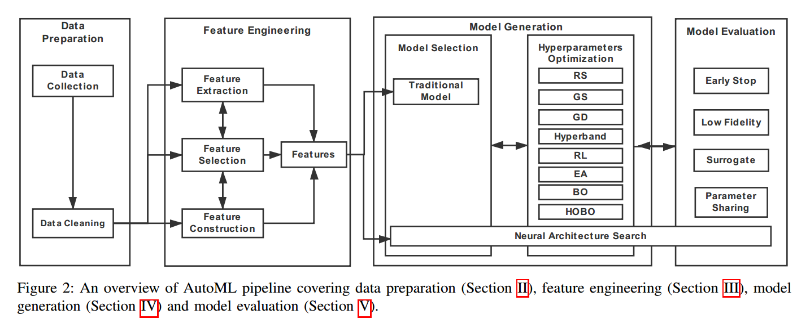
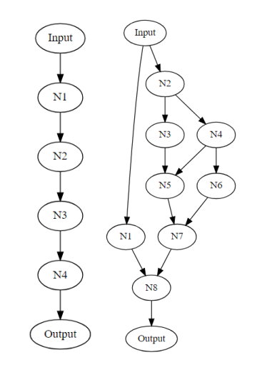
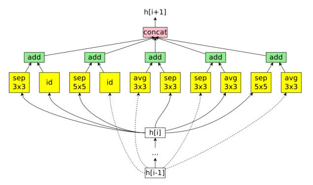
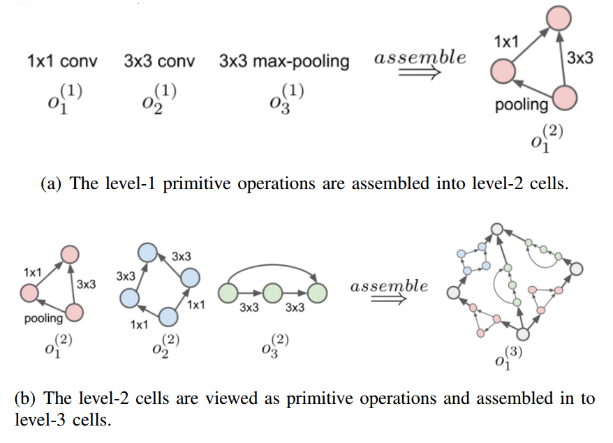
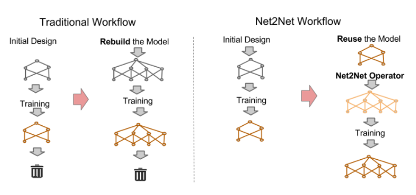
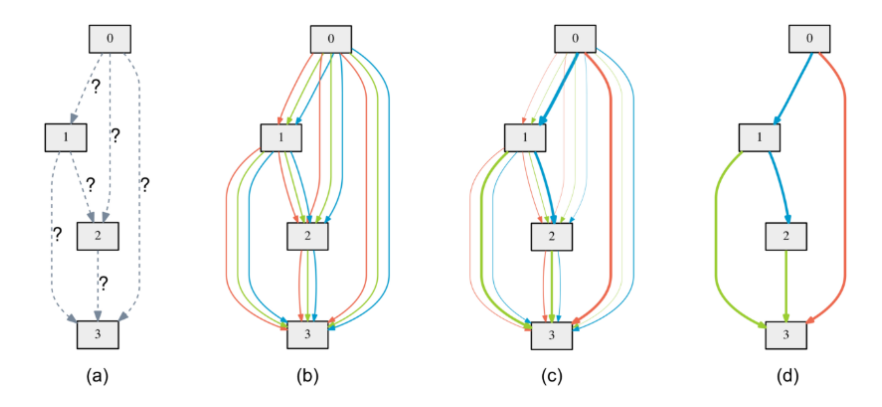
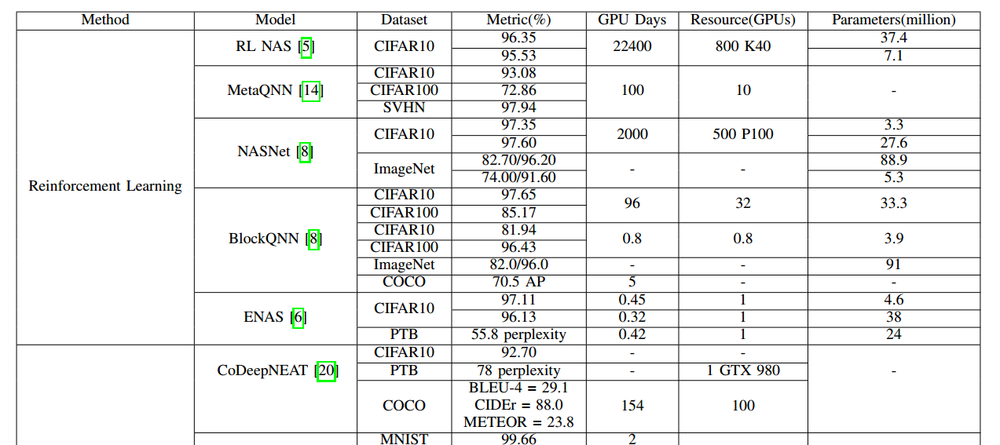

# AutoML: A Survey of the State-of-the-Art

## Contact me

* Blog -> <https://cugtyt.github.io/blog/index>
* Email -> <cugtyt@qq.com>
* GitHub -> [Cugtyt@GitHub](https://github.com/Cugtyt)

> **本系列博客主页及相关见**[**此处**](https://cugtyt.github.io/blog/papers/index)

---

<head>
    
    
</head>

## ABSTRACT

首先根据机器学习管道介绍AutoML的技术，然后总结现有的NAS研究，也比较了NAS算法生成的模型和人工设计的模型，最后，展示了未来研究的开放性问题。

## 贡献

* 涵盖了较广的自动化机器学习方法
 
* 多种NAS 算法的细节比较 （基线数据集性能，时间，资源成本，模型大小）

* 开放问题

## 大纲

## 一、数据准备
**A. 数据收集**
1.  数据合成 Data Synthesis
	* 图像： 剪切，翻转，填充，旋转，缩放，
		扭曲（数据域做转换），合成过采样（特征域）
	* 文本： 同义词插入， 翻译-反向翻译
	* 自动驾驶：数据模拟器
	* GAN
2. 数据搜索 （web数据）
    * 数据不匹配关键词： 
        * 过滤，移除出现在多个类中的样本
        * 标签错误： 基于学习的自动标记方法
        * 单标签描述不足： 多标签
    * 分布差异大
        * 微调web数据
        * 不平衡： SMOTE， 根据现有数据合成新的少数样本

**B. 数据清洗**
    * 标准化，缩放，二值化，one-hot，填充缺失值
    * 错误标签： 自动标记算法

## 二、特征工程
**A. 特征选择** （使用原始特征）
* 完整搜索： 宽度优先，分支定界法，定向搜索， 最佳优先搜索
* 启发式搜索：序列前向选择，序列反向选择，双向搜索
* 随机搜索： 模拟退火，基因搜索
* 特征子集验证：
    * 过滤，对每个特征根据多样性和相关性评价
    * 包装，用特征子集分类，准确率作为评价指标
    * 嵌入方法，把变量选择作为学习过程（如正则化，决策树，深度学习）

**B. 特征构建**：（生成特征）人工方法，标准化，归一化，离散化

**C. 特征提取**： 会修改特征（特征选择不修改），PCA, 独立主成分分析，LDA，自动编码器。

## 三、模型生成
### A. 模型结构 

**整体结构**：搜索空间大

**基于cell的结构**： 搜索cell，然后拼接，降低复杂度

**层次结构**：与基于cell的方式相比，生成cell方式不同

有多种层次，每层有固定数量的cell

**基于Morphism的结构**：
将现有的知识迁移到网络中，不用重新开始

### B. 超参数优化

* 网格/随机搜索
* 强化学习
    * 控制器：RNN，用于生成不同的子网络
    * 奖励网络： 训练和衡量生成的网络，用于更新生成器
* 演化算法
    * 选择，交叉，变异，更新
* 贝叶斯优化：根据历史迭代更新，SMBO，BOHB
* 梯度下降：
    * 连续可微方式搜索，减少搜索时间，但是所需要的空间线性增长
    * 所有可能操作的概率分布进行优化

## 四、模型评估

### A. 低保真度
减少图像数量，或者图像的分辨率

### B. 迁移学习
使用先前任务的知识来加速NAS
基于morphine的算法可以继承先前结构的权重

### C. 代理（Surrogate）
优化已经差不多好的近似解，比优化原始目标要容易

### D. 早停
及时停止验证集上表现差的

## 五、性能总结
指标（准确率），搜索时间，资源，模型大小

* 基于梯度下降的方法更有效率，时间短，资源占用少
* 演化算法需要大量的时间和资源，同时搜索和验证大量子网络
* 随机搜索也可以达到不错的性能
* CIFAR 10上NAS已经超过人工设计的网络
* PTB上还有很大差距

## 六、开放问题和未来工作
* 完整的AutoML管道， 很多工作没有包括数据收集过程，没有自动化特征工程
* 可解释性，没有严格证明为什么某些特定的运算好
* 可复现性，很难复现
* 灵活的编码方案，现在是人工定义，是否有新的方案和网络结构？
