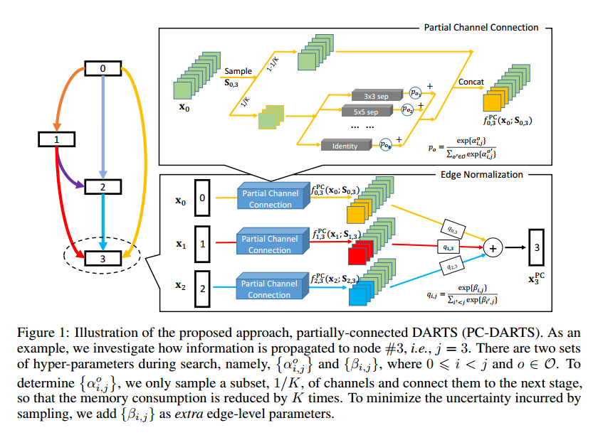
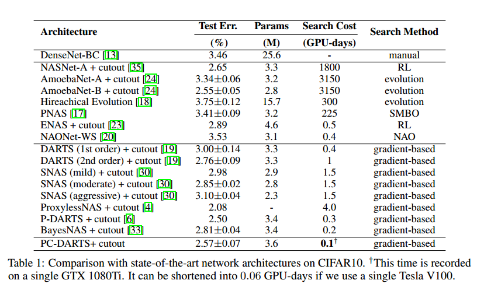
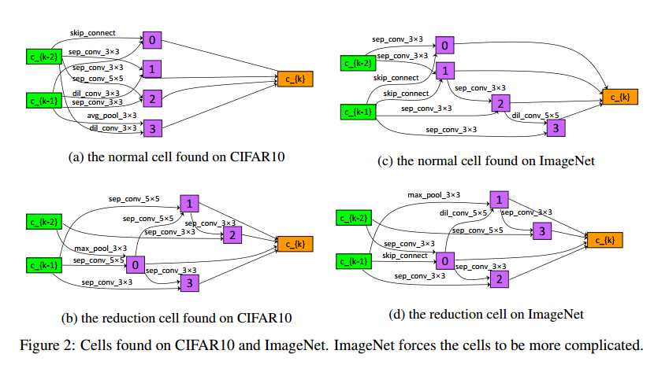
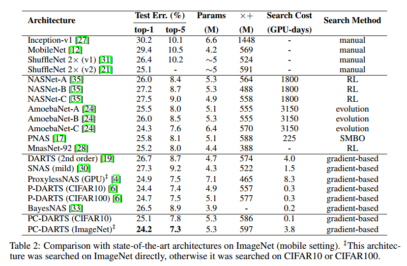
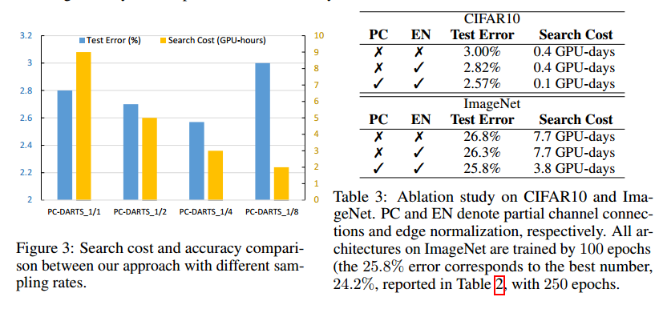

# PC-DARTS: Partial Channel Connections for Memory-Efficient Differentiable Architecture Search

## Contact me

* Blog -> <https://cugtyt.github.io/blog/index>
* Email -> <cugtyt@qq.com>
* GitHub -> [Cugtyt@GitHub](https://github.com/Cugtyt)

> **本系列博客主页及相关见**[**此处**](https://cugtyt.github.io/blog/papers/index)

---

<head>
    
    
</head>

## ABSTRACT

Differentiable architecture search (DARTS)方法速度快，但是需要大量内存和计算资源，因为它要训练一个超大的网络（super-net）来寻找最优的结构。

我们提出了 Partially-Connected DARTS，通过采样super-net的一小部分来降低冗余的空间，可以更有效，同时没有性能损失。我们在通道子集上执行运算搜索，其他部分不变。这可能导致挑选超大网络边时出现不一致性。因此提出*边正则化*，在搜索中添加边级别的超参数集合，来减少搜索的不确定性。

由于减少了内存，PC-DARTS可以用更大的批量，有更快的速度，更高的训练稳定性。CIFAR10上0.1GPU天可以达到2.57%的错误率，在移动端下，3.8GPU天可以达到24.2%的TOP1错误率。

## 1 Introduction

DARTS把运算选择看做是运算集合的加权组合，可以让网络的超参数搜索可微，进而达到端到端。但是由于复杂的设计，它有大量的冗余搜索空间，计算量和内存很大，不能使用大的批量。

我们的PC-DARTS可以减少内存和计算量。想法是：不把全部通道送入运算选择中，而是随机采样通道子集进行运算，其他的直接通过。前提假设是通道子集可以作为全集的近似。但是带来的问题是，由于采样的随机性，网络连接的选择可能是不稳定的。因此引入边标准化（edge normalization）进行稳定，做法是添加一个额外的边选择超参数集合。

得益于部分连接策略，我们可以增大批量。选择$1/K$的通道可以减少K倍内存。可以增大K倍批量，不仅可以加速K倍，还可以稳定搜索。

## 3 The Proposed Approach

### 3.1 Preliminaries: Differentiable Architecture Search (DARTS)

DARTS把网络的搜索拆分为L个cell，每个cell为N个节点的有向无环边，每个节点是一个网络层。预定义运算空间是$\mathcal{O}$，每个元素$o(\cdot)$是一个运算表示一个网络层，目标就是选择一个运算连接每个节点。设节点对为$(i, j)$，那么运算的加权就是$f_{i, j}\left(\mathbf{x}_{i}\right)=\sum_{o \in \mathcal{O}} \frac{\exp \left\{\alpha_{i, j}^{o}\right\}}{\sum_{o^{\prime} \in \mathcal{O}} \exp \left\{\alpha_{i, j}^{o \prime}\right\}} \cdot o\left(\mathbf{x}_{i}\right)$。【略】这样就可以进行可微搜索。

### 3.2 Partial Channel Connections

DARTS的问题是需要大量内存。为了调节$|\mathcal{O}|$个运算，需要把每个运算的结果存储起来，需要使用$|\mathcal{O}|$倍的内存。为了能存下必须降低批量大小，但是就降低了速度。

或者使用部分通道连接，如图1。比如从 $\mathbf{x}_{i}$ 到 $\mathbf{x}_{j}$ ，定义采样mask $\mathbf{S}_{i, j}$ ，标为1的直接作为输出：

$$f_{i, j}^{\mathrm{PC}}\left(\mathbf{x}_{i} ; \mathbf{S}_{i, j}\right)=\sum_{o \in \mathcal{O}} \frac{\exp \left\{\alpha_{i, j}^{o}\right\}}{\sum_{o^{\prime} \in \mathcal{O}} \exp \left\{\alpha_{i, j}^{o^{\prime}}\right\}} \cdot o\left(\mathbf{S}_{i, j} * \mathbf{x}_{i}\right)+\left(1-\mathbf{S}_{i, j}\right) * \mathbf{x}_{i}$$

我们挑选1/K，这个超参数可以用来平衡速度和准确率。这样不仅可以减少K倍的计算量，还可以有更多的样本来采样，这对于网络搜索尤为重要。

### 3.3 Edge Normalization

采样的好处是减少所选操作的偏置，即对于边$(i, j)$，给定 $\mathbf{x}_{i}$ ，使用两组超参数  $\left\{\alpha_{i, j}^{o}\right\}$ 和 $\left\{{\alpha^{\prime}}_{i, j}^{o}\right\}$ 的差距就减小了。但是它减弱了无权重运算（如跳跃连接，最大池化）的优势。在早期，搜索算法更喜欢无权重的运算，因为这些运算没有参数能输出一致的结果。但是对于有权重的运算，优化过程中会出现不一致的情况。这样无权重的运算会占据很大的比重，后续有权重的运算优化的很好也无法超过他们。这种现象在代理输入（结构搜索处理的）比较困难的时候尤其严重，这导致DARTS在ImageNet上效果不好。PC-DARTS能生成更好的效果。

坏处是，在原始的DARTS中，每个输出节点 $\mathbf{x}_{j}$ 都需要从 $\{ \mathbf{x}_{0}, \mathbf{x}_{1}, \dots, \mathbf{x}_{j-1} \}$ 挑选两个输入节点，权重分别为： $max_o \alpha ^ o _ {0, j}, max_o \alpha ^ o _ {1, j}, \dots, max_o \alpha ^ o _ {j-1, j}$ 。但是这些结构参数是通过随机采样的通道来优化的，可能并不稳定，导致网络结构的波动变化。我们引入了边标准化，对每条边$(i, j)$显式赋予权重，记作 $\beta_{i,j}$ ，这样，$\mathbf{x}_{j}$ 的计算变成：

$$x_{j}^{\mathrm{PC}}=\sum_{i < j} \frac{\exp \left\{\beta _{i, j}\right\}}{\sum_{i<j} \exp \left\{\beta_{i', j}\right\}} \cdot f_{i, j} (\mathbf{x}_{i})$$

在搜索结束后，边的连接 $(i, j)$由 $\{ \alpha_ {i,j} ^ 0 \}$ 和 $\beta_ {i, j}$ 共同决定。

【略】

## 4 Experiments

## 5 Conclusions

PC-DARTS的核心是随机采样一部分通道用于运算搜索，这样框架可以更有效的利用内存，可以使用更大的内存获得更高的稳定性。通过边标准化对搜索进行稳定，这是一个轻量化的模块，基本不需要太多计算量。在0.1GPU天完整搜索CIFAR10，3.8GPU天搜索ImageNet。