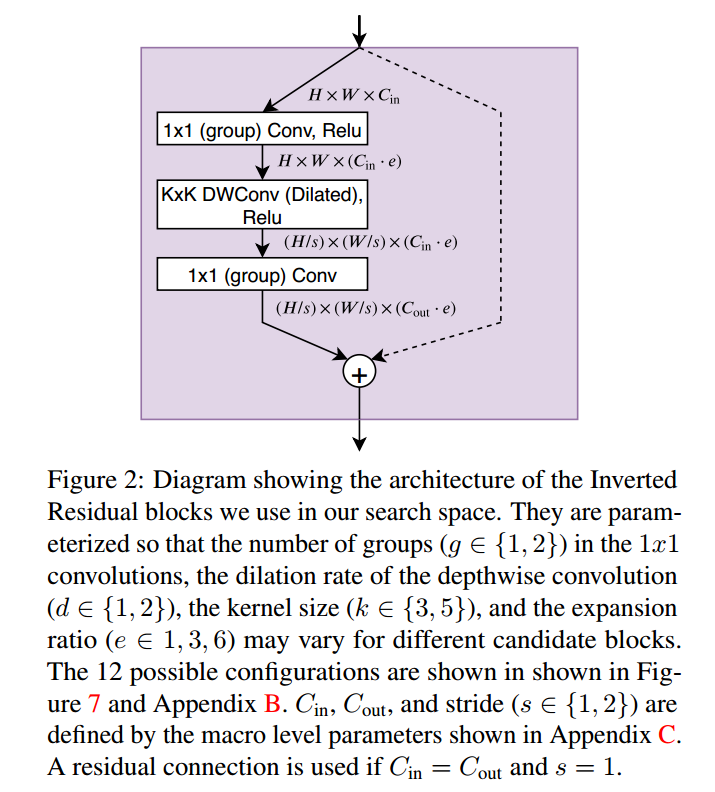
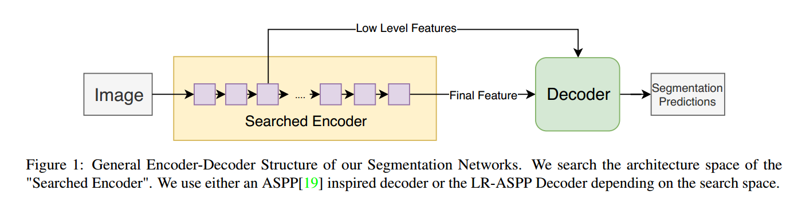
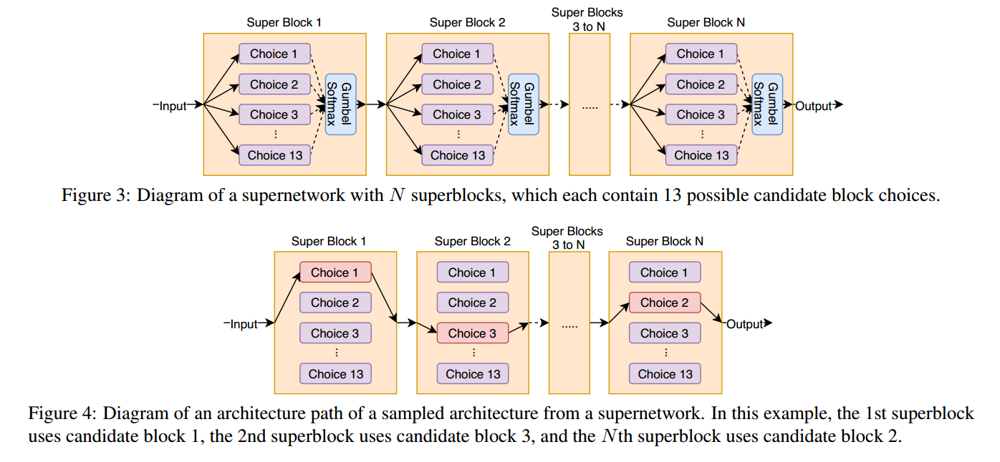
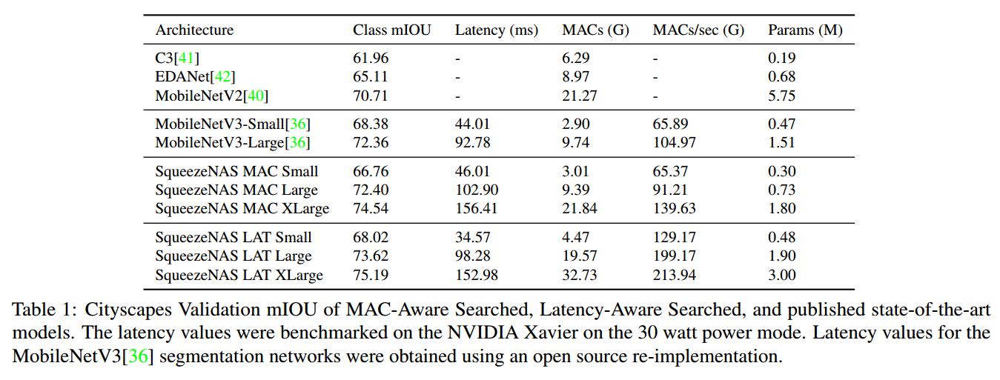
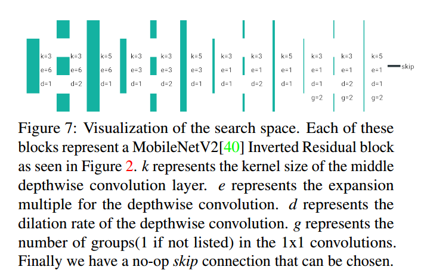
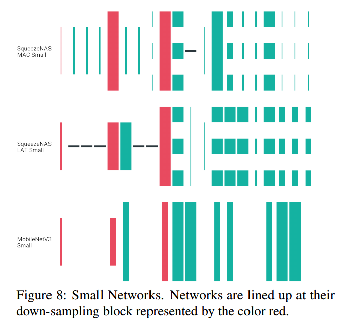
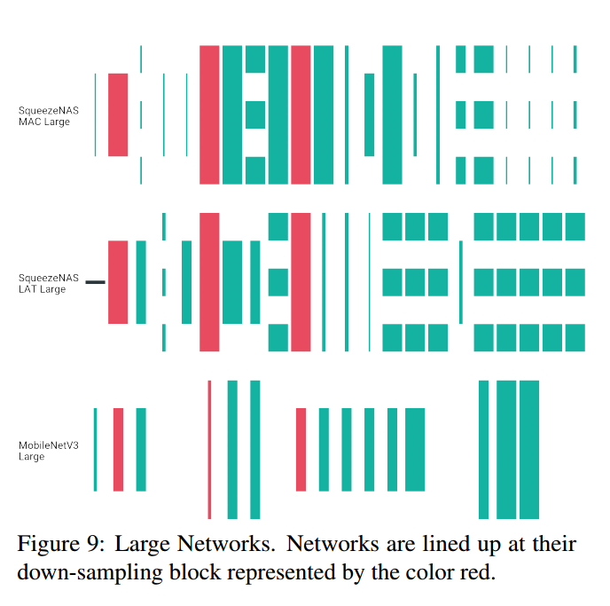
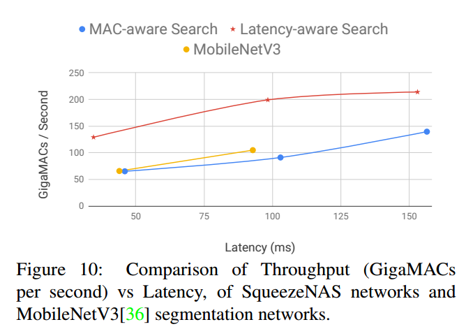

# SqueezeNAS: Fast neural architecture search for faster semantic segmentation

## Contact me

* Blog -> <https://cugtyt.github.io/blog/index>
* Email -> <cugtyt@qq.com>
* GitHub -> [Cugtyt@GitHub](https://github.com/Cugtyt)

> **本系列博客主页及相关见**[**此处**](https://cugtyt.github.io/blog/papers/index)

---

<head>
    
    
</head>

## ABSTRACT

真实场景下，需要DNN在目标任务上准确率高，在目标计算平台上推断延迟低。NAS已经被用于低延迟的图像分类，但是其他任务还很少。这是第一篇用于密集语义分割的无代理硬件感知的搜索。在Cityscapes数据集上达到最好的性能。我们证明了利用NAS对任务和推断同时优化可以获得极大地性能提升。

## 1. Introduction and Motivation

在做非图像分类任务（如语义分割或目标检测）时，流行的方法是结构迁移：从一个图像分类网络开始，在网络末尾添加一些针对特定任务的层。

这种结构迁移的主流主要是一些传统假设，我们罗列一些并证明为什么他们已经过时了。

* **假设1： 在ImageNet上准确率最高的网络也应该是目标任务上准确率最好的骨干网络**

实际上，ImageNet的准确率与目标任务准确率关系不太大。SqueezeNet在ImageNet上准确率低于VGG，但是对上定位图像相似部分的任务上更好。正确的网络设计取决于目标任务。

* **假设2： NAS成本过高**

实际上，有些方法的确需要数千个GPU天，但是最近的“supernetwork”方法例如DARTS和FBNet可以在10个GPU天上取得最优结果。

* **假设3： 低MAC（Fewer multiply-accumulate）运算在目标平台上有较低的延迟**

实际上，有工作证明了相同的平台上，同样的MAC可以有10x的延迟差异。取决于处理器和内核实现，即使是相同的MAC也有不同的速度。

为了在目标计算平台和任务上获得更低的延迟，更高的准确率：

1. 直接对目标任务运行NAS，例如目标检测、语义分割，不要去优化代理任务，如图像分类。
2. 使用现代的基于supernetwork的NAS，相信搜索可以快速收敛。
3. 让NAS同时优化准确率和延迟。

## 2. Related work

【略】

## 3. Architecture Search Space

我们探索了顺序反向残差模块的语义分割网络编码器的空间。这些块参数化如图2。每次结构搜索，我们约束宏观结构，对每个块寻找最优参数。搜索空间和FBNet，MobileNetV2，MobileNetV3相似，这样可以直接比较对分割优化的网络和他们对分类优化的网络。

我们网络的基本结构如图1，解码器使用编码器的输出和低层特征。

### 3.1. Constrained Macro-Architecture

搜索三个空间，Small, Large, XLarge。为了定义结构空间，先约束编码网络的宏观结构。宏观结构描述了编码器的模块数量N，解码器也是这么多。对于每个模块，固定输入和输出通道，`$C_{in}$` 和 $`C_{out}$` ,每个块的深度卷积层步长使用1或2。由于运行跳跃连接，所以最终的层数可能小于N。

在Small和Large的搜索空间，使用LR-ASPP解码器。在XLarge搜索空间，我们使用完全深度卷积的ASPP变种。

### 3.2. Block Search Space

在每个宏观搜索空间，NAS挑选每个块最优的超参数，或者替换为无运算的跳跃连接。如图2，超参数定义了 1*1 卷积是否分组，深度绝技是否膨胀2倍，深度卷积的核大小k，膨胀率e。如图7，我们挑选12个可能的配置。

## 4. Neural Architecture Search Algorithm

把结构搜索看做是复杂supernetwork的路径选择问题，这样确定的结构可以看做是supernetwork的某些路径。如图3，我们定义supernetwork为superblocks的序列，图4是一个例子。

同时优化卷积权重$w$和结构参数$\theta$，优化损失函数：

$$L(\theta, w) = L_P (\theta, w) + \alpha * L_E (\theta)$$

`$L_P$`表示特定问题的损失，`$L_E$`是资源感知损失项，超参数$\alpha$控制两个平衡。由于本工作关注与语义分割，`$L_P$`是像素级别的交叉熵。对于`$L_E$`我们同时实验了目标平台的推断延迟和Multiply-Accumulates的估计值。

### 4.1. Gumbel-Softmax

为了让supernetwork的优化和计算可跟踪，每个superblock独立挑选一个候选块。这样，可以把这个选择看成是对独立类别分布的采样，把superblock i的候选块j概率记作$p(i, j)$。用softmax定义：

$p(i, j \vert \theta) = \frac{e^{\theta_{i,j}}}{\sum_j^{13} e^{\theta_{i, j}}}$

类别分布很难高效优化，所以我们使用Gumbel-Softmax松弛。Gumbel-Softmax分布由稳定参数t控制，t趋近于0，Gumbel-Softmax分布等价于类别分布，稳定参数从5.0到1.0退火。

## 4.2. Early Stopping

我们的supernetwork方法中，优化过程需要计算每一个候选的block，无论学到的结构分布是什么。当最优的网络结构收敛的时候，性能差的候选块虽然选择的概率低，但是依然需要继续计算。所以当候选概率小于0.5%的时候，直接移除。虽然有可能低概率的候选块可能后面是最优的，但是实践中没有发现这种情况。该优化可以减少一半的搜索时间。

## 4.3. Resource-Aware Architecture Search

定义资源感知损失为：

$$L_E(\theta) = \sum_j^N \sum_i^{13} p(i,j \vert \theta _i) C (i, j)$$

$C (i, j)$表示网络块i选择候选j的资源成本。对每个块独立建模资源成本。$C$也可以做成查找表的形式，这样只需要计算一次。

## 5. Experiments and Results

证明两个关键点：第一，NAS是可以产生搞准确率低延迟网络的工具。第二，优化与硬件无直接联系的指标如MAC不是个合适的代理，可能导致局部最优。

沿用Small, Large, XLarge三种搜索空间。先用NAS在每个空间上对MAC进行搜索，然后在嵌入式设备上查看这些低MAC的网络的延迟作为基线。最后再搜索优化硬件感知的延迟找到3个新的网络。

### 5.1. Hardware-Agnostic Search

对于与硬件无关的结构搜索，使用NAS对MAC进行优化，在MAC和mIOU上找到pareto最优，根据查找表计算每个候选块j的MAC，使得$C(i, j) = MACS_{i,j}$。对每个搜索空间搜索找到最优的SqueezeNAS-MAC网络，结果如下表。

### 5.2. Hardware-Aware Search

使用相同的NAS算法和搜索空间，但是使用延迟优化目标：$C(i,j) = Latency_{i,j}$。为了计算每个模块j在候选j上的延迟，我们测量了目标平台上所有候选的推断时间，最后得到三个SqueezeNAS-LAT网络。结果见表1。

### 5.3. Implementation

### 5.4. Results

## 6. Network Analysis

比较三者的模块选择：优化延迟的网络（Latency-aware），优化MAC的网络（MAC-aware），MobileNetV3。由于这三个都使用反向残差块，可以把MobileNetV3的块放入13个候选中，如图7。这里没有考虑SE块。

可视化网络如图8，【略】

## 7. Conclusion

第一、做无代理的语义分割搜索，我们的NAS生成的SqueezeNAS系列模型，相比MobileNet V3达到优越的延迟-准确率平衡。这种优越（至少部分）来自于MobileNetV3是用NAS优化图像分类作为代理实现语义分割任务的。

第二、虽然MobileNetV3作者使用了几千个GPU天，但是我们的方法每次搜索只需要7-15个GPU天。也就是说，基于supernetwork的NAS在8个GPU上不需要一个周末就可以跑出来最好的结果。

第三、我们做了两类NAS实验，一个搜索低MAC模型，一个搜索目标平台上低延迟模型。第二个我们获得了非常快同时准确率高的模型。最后，考虑到芯片的速度提升和计算平台的省级，NAS可以继续获得更低的延迟。