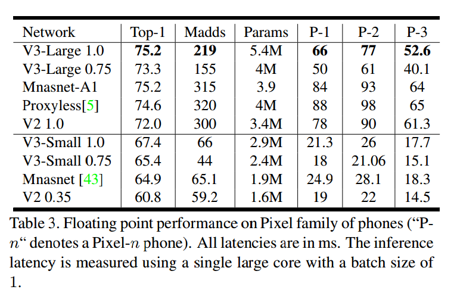

# Searching for MobileNetV3

## Contact me

* Blog -> <https://cugtyt.github.io/blog/index>
* Email -> <cugtyt@qq.com>
* GitHub -> [Cugtyt@GitHub](https://github.com/Cugtyt)

> **本系列博客主页及相关见**[**此处**](https://cugtyt.github.io/blog/papers/index)

---

<head>
    
    
</head>

## ABSTRACT

通过硬件感知网络结构搜索（NAS）结合NetAdapt算法，并通过最新的框架改进，让MobileNetV3可以用于移动手机CPU。本文探索了自动搜索算法和网络设计如何进行结合互补达到当前最好的性能。两个模型MobileNetV3-Large和MobileNetV3-Small用于资源多和少的不同情况，可以用于目标检测和语义分割。对于语义分割任务，我们提出了新的高效分割解码器Lite Reduced
Atrous Spatial Pyramid Pooling (LR-ASPP)，在移动端达到SOTA。

## 1. Introduction

本文的目的是开发出可能最好的移动端计算机视觉结构，达到准确率和延迟的最佳平衡，提出了：1）互补的搜索技术，2）移动端下新的高效非线性实践，3）新的高效网络设计，4）新的高效分割解码器。

## 3. Efficient Mobile Building Blocks

**MobileNetV1**提出了深度可分卷积（ depthwise separable convolutions ）作为传统卷积的高效替代，通过特征进行空间过滤有效的分解了传统的卷积。深度可分卷积由两层定义：轻量深度卷积用于空间过滤，重量的$1*1$逐点卷积（pointwise convolutions）用于特征生成。

**MobileNetV2**借助问题的低阶特点引入线性瓶颈和反向残差块让结构更有效。如图3，1\*1的扩展卷积后为深度可分卷积和1\*1的映射层。输入输出通道一样的话进行残差连接，虽然输入输出维度一样，但是内部扩展到了高维特征空间，增加了非线通道的表示能力。

MnasNet在MobileNetV2的结构上增加了基于SE的轻量级注意力模块。注意挤压和激励模块在不同的地方组合。这个模块位于扩展中深度滤波器之后，用于在最大的表示上应用注意力。

对于MobileNetV3，把这些结合起来。

## 4. Network Search

### 4.1. Platform-Aware NAS for Block-wise Search

直接使用了MnasNet-A1作为初始的Large移动端模型。然后在他的上面应用NetAdapt和其他优化方法。

但是，原始的奖励设计不是对小型移动模型优化的，使用的是多目标奖励 $ACC(m) \times [LAT(m)/TAR]^w$作为近似Pareto最优解，用于模型$m$在目标延迟TAR上平衡$ACC(m)$和$LAT(m)$。我们观察到小模型上准确率对于延迟改变非常大，因此使用了小的权重因子$w=-0.15$【略】

### 4.2. NetAdapt for Layer-wise Search

第二个方法是NetAdapt。这个方法是随平台感知NAS来的：它允许对序列层中的单个层进行微调。他的步骤为：

1. 从平台感知的NAS找到的种子网络结构开始。
2. 每一步中：
   * 生成新的提议集合。每个提议表示一个结构优化，与之前一步相比至少减少$\delta$的延迟。
   * 对于每个提议，使用前一步预训练的模型，放到新的结构中，截断并且随机初始化缺失的权重。微调每一个提议T步，然后获得一个粗糙的准确率估计。
   * 根据衡量指标挑选最好的提议。
3. 迭代上面步骤，直到到达目标延迟

我们优化的是准确率改变和延迟改变的比值。对于NetAdapt的每一步，我们挑选一个最大化$\frac{\Delta Acc}{\vert latency \vert}$。

达到目标延迟后，我们再次从头训练新的结构。我们允许以下两类提议：

1. 减少任意扩展层的大小
2. 减少共享相同瓶颈大小的瓶颈，保持残差连接

## 5. Network Improvements

对于计算量大的层我们进行了重新设计，也引入了新的非线性，h-swish，swish非线性的修改版。

### 5.1. Redesigning Expensive Layers

我们观察到，在模型搜索完成后，最后一些层和一些前面的层比其他层计算量更大。我们对这些层进行了修改，这些修改不包括在搜索空间中。

第一个修改是，让最后那些层更高效的处理生成最后的特征。基于V2反向瓶颈结构及其变种的模型使用$1\*1$卷积作为最后一层，用于扩展到高维特征空间。但是会带来额外的延迟。

我们把这一层移动到平均池化之后，这样特征在$1\*1$的空间上，而不用计算$7\*7$的空间，这样的结果是特征的计算量基本没有了。

一旦这一层的计算量减少了，那么也不需要前面的瓶颈映射层来减少计算量了。这样我们可以移除前面瓶颈层的映射和滤波层，进一步减少计算复杂度，如图5。这里大约减少了10毫秒15%的运行时间。

另一个昂贵的层是初始的滤波器。现在的移动端模型使用32个$3\*3$大小的滤波器初始块用于边界检测。我们尝试减少滤波器的数量，使用不同的非线性函数来减少冗余。在这一层使用hard swish，和其他的非线性差不多，滤波器减少到了16个，进一步减少了3毫秒的时间。

### 5.2. Nonlinearities

$$swish = x \cdot \sigma(x)$$

这个函数提升了准确率，但是在嵌入式设备和移动设备上增大了计算量，两种方法来解决：

1. 把sigmoid替换为$\frac{ReLU6(x+3)}{6}$：

$$h-wish[x] = x \frac{ReLU6(x+3)}{6}$$

图6是hard-swish和soft-swish的比较。我们发现硬版本没有准确率上的不同，但是部署上有优势。首先，ReLU6的优化实现基本在任何硬件和软件平台都有。第二，量化模式下，消除了不同sigmoid实现导致的数值精度损失。最后，优化的sigmoid也比ReLU慢。把h-swish替换成swish增加了15%的推断延迟。

2. 非线性的代价随网络深度中减少，因为每次分辨率下降会降低激活函数的计算量。我们发现swish的优势更深的层上出现，因此我们只在第二半模型中使用h-swish。

#### 5.2.1 Large squeeze-and-excite

【略】

### 5.3. MobileNetV3 Definitions

## 6. Experiments

【略】