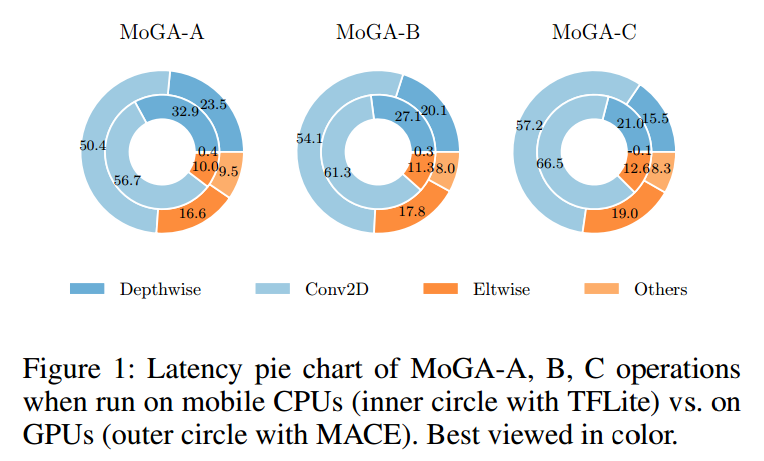

# MoGA: Searching Beyond MobileNetV3

## Contact me

* Blog -> <https://cugtyt.github.io/blog/index>
* Email -> <cugtyt@qq.com>
* GitHub -> [Cugtyt@GitHub](https://github.com/Cugtyt)

> **本系列博客主页及相关见**[**此处**](https://cugtyt.github.io/blog/papers/index)

---

<head>
    
    
</head>

## ABSTRACT

现在大部分模型搜索关注于CPU的延迟，而不关心GPU，但是后者开支更小，工业界更偏向与GPU。因此提出Mobile GPU-Aware (MoGA)网络结构搜索，专为真实世界的应用定制。移动端网络设计的最终目的是在有限的资源下获得最好的性能。虽然希望在有限的时间下获得最大的性能，但是我们更希望增加模型参数以获得更高的表示能力。

## 1 Introduction

我们希望在可接受的延迟范围内提高模型的表示能力。第一，从对移动端的CPU优化转为对GPU优化，这样可以更精确的衡量模型速度，提供直接用于生产的解决方案，图1是针对不同平台生成的不同模型。第二，出了要考虑准确率，延迟和参数数量外，还要考虑的是减弱他们之间的竞争。一个要点是，增大模型的参数可以提升性能，但是不见得会增加延迟。因此移动端我们要避免的是欠拟合而不是过拟合。这样，我们更关心准确率和延迟，参数量的重要性就降低了，可以吧传统的多目标优化改为加权策略。最后，我们的模型在GPU上有很好的性能。

## 3 Mobile GPU-Aware NAS Based on Multi-Objective Optimization

### 3.1 Mobile GPU Awareness

MnasNet的奖励是 $ACC \times (LAT / TAR)^w$，需要很小心$w$来平衡延迟和准确率。

## 7 Conclusion

TODO