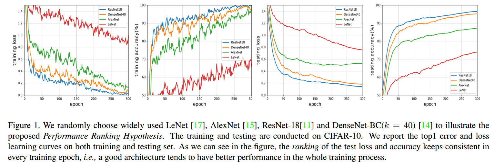
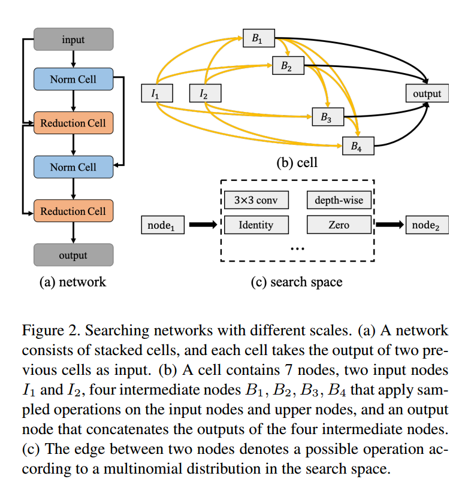
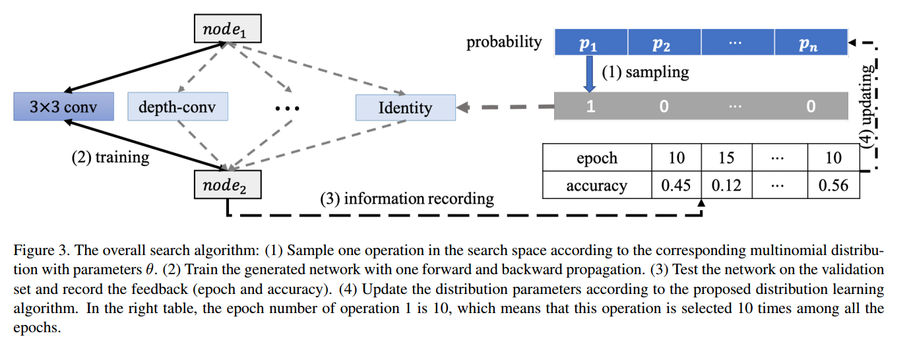
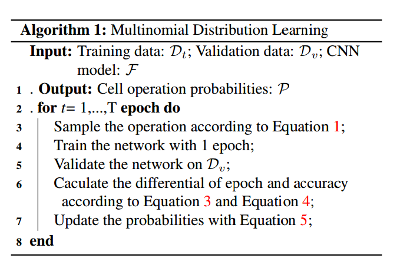
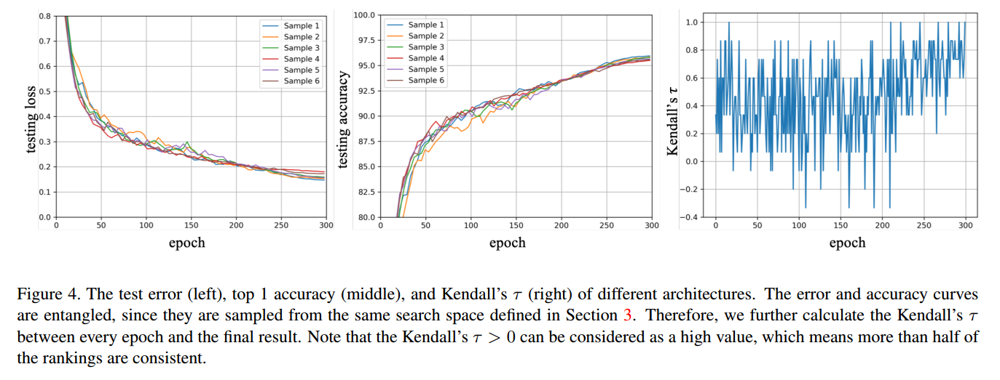
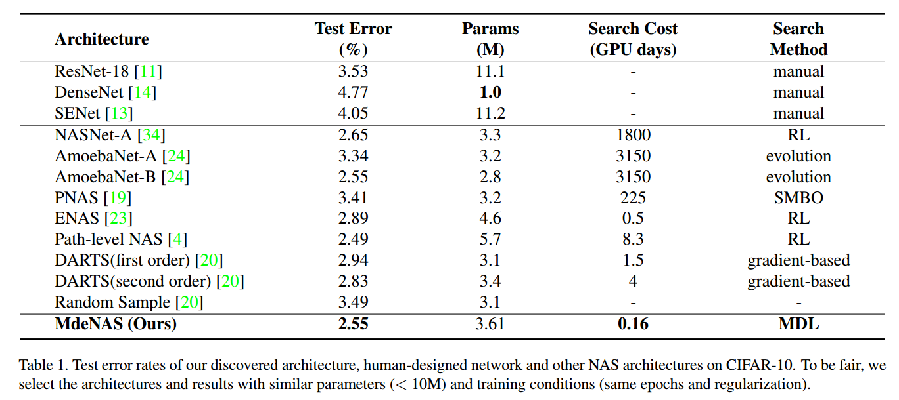
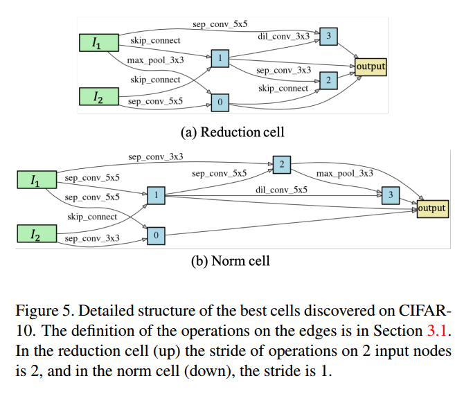
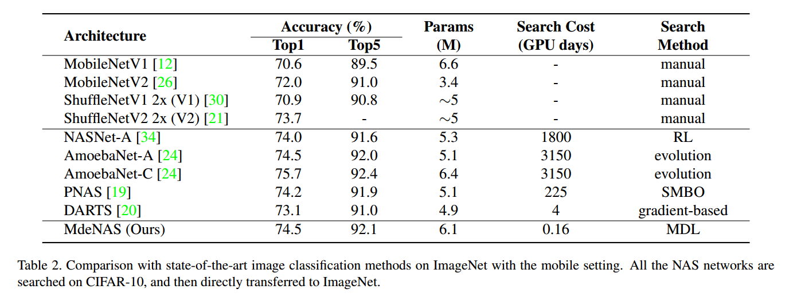
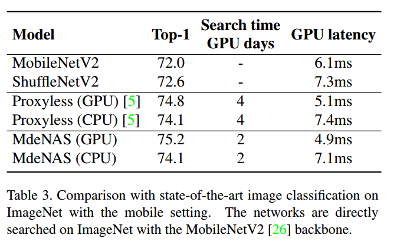

# Multinomial Distribution Learning for Effective Neural Architecture Search

## Contact me

* Blog -> <https://cugtyt.github.io/blog/index>
* Email -> <cugtyt@qq.com>
* GitHub -> [Cugtyt@GitHub](https://github.com/Cugtyt)

> **本系列博客主页及相关见**[**此处**](https://cugtyt.github.io/blog/papers/index)

---

<head>
    
    
</head>

## ABSTRACT

过高的计算量使得NAS难以在实践中应用，我们提出了多项式分布学习用于有效的进行NAS，也就是说，把搜索空间看做是联合多项式分布，最优的网络结构是由这个分布中最高概率的运算得到的。这样NAS可以转换成多项式分布学习问题，优化分布来达到最高的期望性能。提出并证明了一个假设，性能指标在每个训练轮次是稳定的，这更进一步加速了学习过程。在CIFAR10上，我们的方法达到了2.55%的错误率，比当前最好的NAS快6倍（只需要4个GPU小时）。在ImageNet上，达到了75.2%的准确率（MobileNetV1/V2的设置），但是快了1.2倍。

## 1. Introduction

NAS包括三个部分：搜索空间，搜索策略，性能估计。NAS通过某个搜索策略对特定的卷积结构进行采样，然后估计性能，并看做目标来更新搜索策略。但是NAS方法有过高的计算量和内存占用。虽然有可微的NAS方法把搜索空间松弛到连续的空间上，但是内存占用还是太大，随着候选搜索集合线性增长。

大部分NAS通过标准的训练和验证过程来衡量搜索模型的好坏，但是训练到收敛计算量过大。如果验证步骤可以在几个epoch中完成，那就不需要训练网络直到收敛了。考虑图1的例子，随机挑选了几个网络结构，训练和测试的性能指标一致的（在不同的网络上，不同的训练轮次上，ResNet-18 >
DenseNet-BC > AlexNet > LeNet）。基于此，我们提出如下假设：

**Performance Ranking Hypothesis** 在特定任务上，如果Cell A比Cell B有更高的验证性能，那么训练到收敛，Cell A相对于Cell B在不同的网络结构上都倾向于有更高的性能。

这里，一个cell指的是一个全卷积的有向无环图，最后的网络是通过堆叠不同数量的cell得到的。基于这个假设，不同模型的比较可以在前几个阶段就可以完成，获得最后的结果是不必要的，同样也非常消耗时间。因此我们提出Multinomial distribution for efficient Neural Architecture Search (MdeNAS)，把NAS形式化为分布学习过程。候选运算间的概率初始化为相同值，可以看做是多项式分布。在学习中，每个epoch根据当前的性能更新分布的参数，这样将差的运算转换为好的运算。这样可以快速的搜索到高性能网络。

贡献：

* 提出了一个新的NAS方法，占用的内存和计算量都和普通网络训练相近。
* 提出了性能指标假设，结合NAS算法可以加速搜索
* 实验性能好

## 3. Architecture Search Space

如图2，网络在不同的尺度上定义：network，cell，node。

### 3.1. Node

node是组成cell最基本的元素。每个节点$x^i$是一个特定的张量，每一个有向边$(i,j)$表示一个运算$o^{(i,j)}$，这个运算是从节点$x^i$到$x^j$采样得到的，如图2c。cell中有三种类型的node，输入节点`$x_I$`，中间节点$x_B$，输出节点$x_O$。候选运算记作$O$，有八种运算：(1)$3\times3$最大池化，(2)无连接（0），(3)$3\times3$均值池化，(4)跳跃连接，(5)$3\times3$空洞卷积，rate 2，(6)$5\times5$空洞卷积，rate 2，(7)$3\times3$深度可分卷积，(8)$5\times5$深度可分卷积。我们简单的对多个输入只使用了元素相加。

### 3.2. Cell

一个cell相当于一个小型的卷积网络，将输入$H\times W \times F$映射到$H' \times W' \times F'$。有两种cell：普通cell和下降cell。普通cell的步长为1，输入输出大小相等，下降cell步长为2，长宽变成原来的一半。通道数可以简单的在下降时加倍。

如图2b，cell是一个7节点的有向无环图。整个搜索空间是`$2\times 8 ^{\vert \epsilon_N \vert}$`，`$\epsilon_N$`，是N个节点可能的边，我们用$N=4$，那么就是$2\times 8^{2+3+4+5} = 2 \times 8^{14}$。

### 3.3. Network

在网络的顶层，是全局均值池化和softmax层，基于性能指标假设，我们训练了一个小的堆叠模型（例如6层），然后生成更深的网络（例如20层）用于验证。

## 4. Methodology

### 4.1. Sampling

开始时，每两个节点之间的路的概率都设置为`$p_i = \frac{1}{M}$`，M是可能的路径个数。在采样阶段，把M个概率`$\{ p_i \}$`二值化`$\{ g_i \}$`:

$$g=\left\{\begin{array}{l}{\underbrace{[1,0, \ldots, 0]}_{M} \text { with probability } p_{1}} \\ {\underbrace{[0,0, \ldots, 1]}_{M} \text { with probability } p_{M}}\end{array}\right.$$

那么节点间的运算就是：

$$o^{(i, j)}=o^{(i, j)} * g=\left\{\begin{array}{l}{o_{1} \text { with probability } p_{1}} \\ {\cdots} \\ {o_{M} \text { with probability } p_{M}}\end{array}\right.$$

### 4.2. Multinomial Distribution Learning

基于我们的假设，我们可以在训练的时候就衡量网络的性能，如图3，搜索空间中每个运算的准确率和训练轮次都记录下来，更少的轮次和更高的准确率表示更好。

定义运算的概率是$p$，训练轮次是$\mathcal{H}^{e}$，准确率是$\mathcal{H}^{a}$，每个都是长度为$M=8$的向量。进一步定义轮次的差值：

$$\Delta \mathcal{H}^{e}=\left[\begin{array}{c}{\left(\overrightarrow{1} \times \mathcal{H}_{1}^{e}-\mathcal{H}^{e}\right)^{T}} \\ {\ldots} \\ {\left(\overrightarrow{1} \times \mathcal{H}_{M}^{e}-\mathcal{H}^{e}\right)^{T}}\end{array}\right]$$

准确率的差值：

$$\Delta \mathcal{H}^{a}=\left[\begin{array}{c}{\left(\overrightarrow{1} \times \mathcal{H}_{1}^{a}-\mathcal{H}^{a}\right)^{T}} \\ {\ldots} \\ {\left(\overrightarrow{1} \times \mathcal{H}_{M}^{a}-\mathcal{H}^{a}\right)^{T}}\end{array}\right]$$

其中$\overrightarrow{1}$是长度为8的列向量，元素都是1，$\Delta \mathcal{H}^{e}$和$\Delta \mathcal{H}^{a}$都是$8\times8$的矩阵，多项式分布的参数可以如下更新：

$$\begin{aligned} p_{i} \leftarrow p_{i}+\alpha *\left(\sum_{j} \mathbb{1}\left(\Delta \mathcal{H}_{i, j}^{e}<0, \Delta \mathcal{H}_{i, j}^{a}>0\right)-\right.& \\\left.\sum_{j} \mathbb{1}\left(\Delta \mathcal{H}_{i, j}^{e}>0, \Delta \mathcal{H}_{i, j}^{a}<0\right)\right) \end{aligned}$$

其中$\alpha$是超参，$\mathbb{1}$是指示函数。

可以看到特定运算$i$的概率可以在更少的epoch`$\Delta \mathcal{H}_{i, j}^{e}>0$`和更高性能`$\Delta \mathcal{H}_{i, j}^{a}>0$`下得到提高，反之降低。由于每个epoch都进行更新，收敛非常快，在少数几轮后就稳定了。

为了得到最终的网络，先选择最大概率的运算，对于多个输入的节点，以top K的概率进行元素相加，最终的网络通过多个cell堆叠。算法如下：

## 5. Experiment

## 6. Conclusion

MdeNAS是首个基于分布学习的NAS方法，基于新颖的性能指标假设可以进一步降低搜索时间。我们的方法可以极大降低计算量同时保持模型准确率。