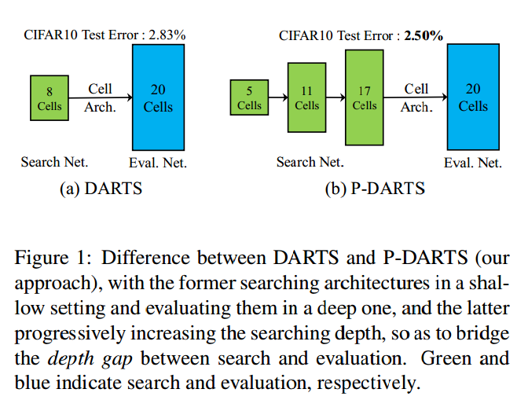
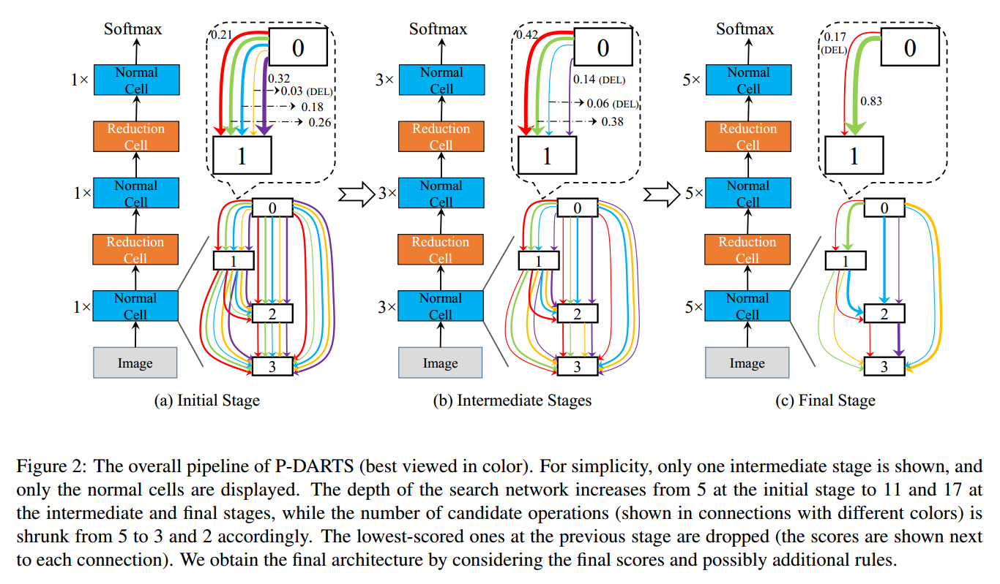
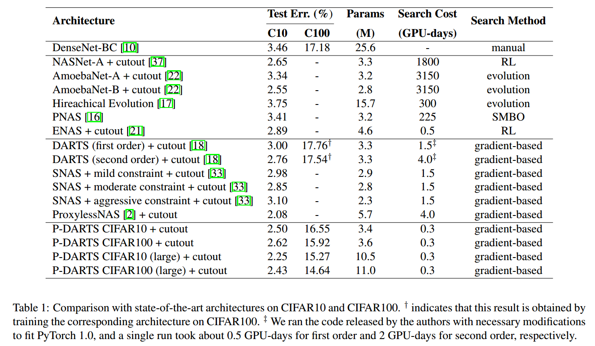
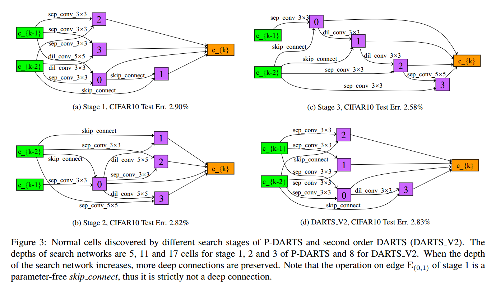
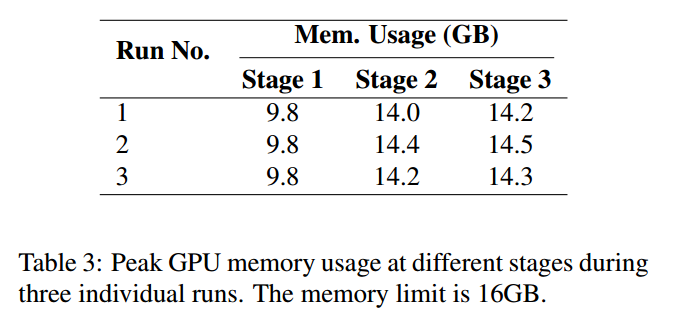

# Progressive Differentiable Architecture Search: Bridging the Depth Gap between Search and Evaluation

## Contact me

* Blog -> <https://cugtyt.github.io/blog/index>
* Email -> <cugtyt@qq.com>
* GitHub -> [Cugtyt@GitHub](https://github.com/Cugtyt)

> **本系列博客主页及相关见**[**此处**](https://cugtyt.github.io/blog/papers/index)

---

<head>
    
    
</head>

## ABSTRACT

可微搜索方法在验证搜索到的结构或者迁移到其他数据集上的时候，准确率比较低。可能的原因是结构在搜索和验证的深度不同。我们提出了一个高效的算法让搜索结构的深度随训练增长。这种方法会出现两个问题：计算量大，搜索不稳定，我们分别使用搜索空间近似和正则来解决。

## 1. Introduction

DARTS在浅层结构上搜索，在深层结构上验证，导致一个问题，搜索到的运算适合浅层结构，在深层上不见得好。

我们提出了Progressive DARTS (PDARTS)，把搜索过程分为几个阶段，不断增加深度。

* 计算量大的问题，通过搜索空间近似解决，也就是说随着深度增加，根据前面阶段的搜索情况减少候选运算的数量。
* 稳定性问题，搜索过程中，算法会强烈的倾向于跳跃连接(skip-connect)，因为梯度下降最快。我们提出了搜索空间正则化，引入运算级别的dropout，缓解跳跃连接的问题，并在验证阶段控制跳跃连接的出现。

可以在CIFAR10上用0.3 GPU天搜索完成。【略】

## 3. Method

### 3.1. Preliminary: DARTS

【可以参考[DARTS](https://cugtyt.github.io/blog/papers/2019/0509)】

### 3.2. Progressively Increasing the Searching Depth

在DARTS中，网络结构用8个cell搜索，验证使用20个cell。但是由于浅层网络和深层网络的行为不同，搜索到的可能不是最好的，我们称之为深度缺口（depth gap）。DARTS的普通cell中，网络倾向于保留较浅的连接，这是因为浅层网络通常有更快的梯度，但是深层的网络性能更好。

有两个困难：首先，模块的数量随着深度指数增长，消耗时间和内存。我们提出了搜索空间近似，不断地减少候选运算的数量。其次，搜索较深的结构时，可微搜索倾向于跳跃连接，因为有更快的下降梯度。我们提出了搜索空间正则化，通过运算级别的dropout防止模型过拟合于跳跃连接，增加稳定性。

#### 3.2.1 Search Space Approximation

搜索空间近似如图2，把搜索框架分成多个阶段，每个阶段`$\mathfrak{S}_{k}$`，网络包括`$L_k$`个cell，运算的空间是`$O_k$`，即`$\vert o_{(i,j)}^k = O_k$`。

在初始阶段，网络比较浅，但是运算空间比较大，在每个阶段`$\mathfrak{S}_{k-1}$`，学习网络参数`$\alpha_{k-1}$`，和候选运算的分数。增加网络深度，新的运算空间变小了`$O_{i,j}^k < O_{i,j}^{k-1}$`，或者相等。然后根据前面得到的运算分数，删除掉最不重要的运算。 

#### 3.2.2 Search Space Regularization

在每一个阶段`$\mathfrak{S}_{k}$`，重新初始化训练网络，（试过用上一阶段的权重，性能差）。由于浅层网络更倾向于选择跳跃连接，限制了可以学习的参数数量，导致性能比较差。

我们通过正则化解决这个问题，首先，插入运算级别的dropout，可以部分剪切掉跳跃连接，帮助网络探索其他的运算。为了防止网络直接删除掉跳跃连接运算，我们逐渐减弱dropout，这样最后还是网络自己来选择。

我们发现跳远连接对于验证阶段的准确率有重要的影响，多次实验发现，最终阶段跳跃连接的数量在2到4个，而识别的性能也于这个数量高度相关，因此，控制跳跃连接的数量为常数$M$。

## 4. Experiments

## 5. Conclusions

不断增大深度的DARTS。【略】