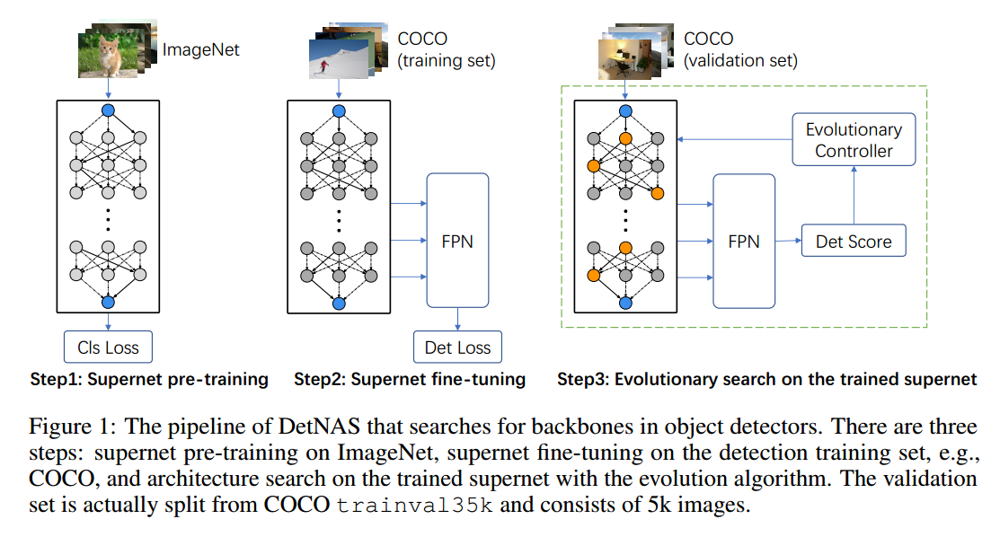
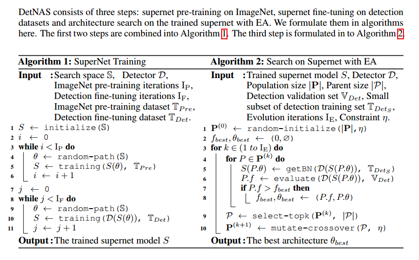
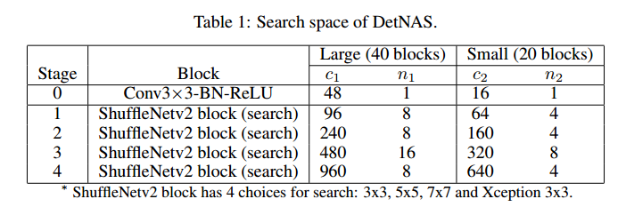
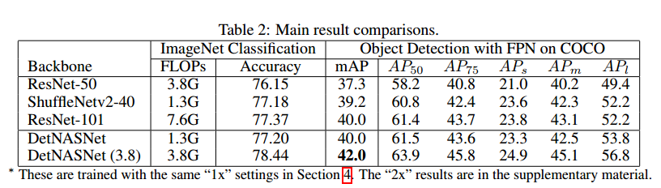
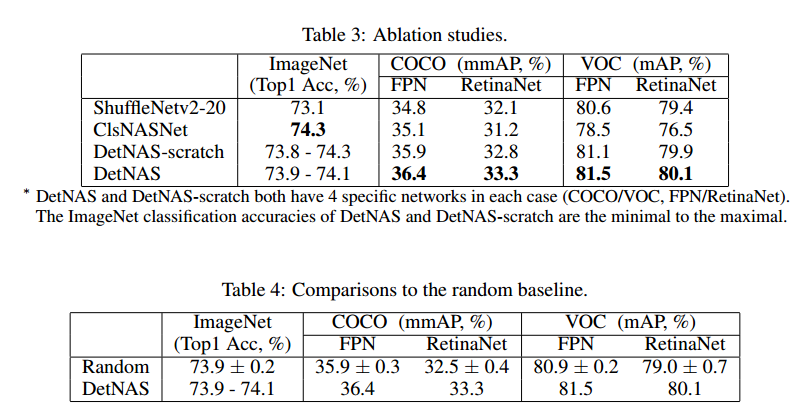
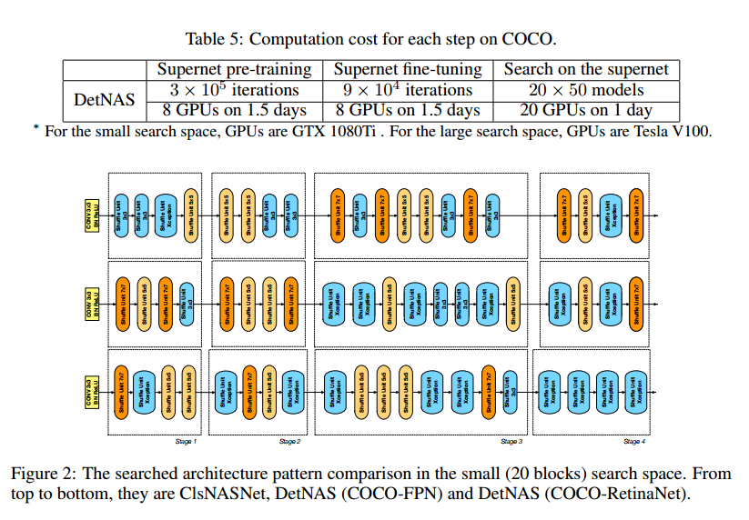

# DetNAS: Backbone Search for Object Detection

## Contact me

* Blog -> <https://cugtyt.github.io/blog/index>
* Email -> <cugtyt@qq.com>
* GitHub -> [Cugtyt@GitHub](https://github.com/Cugtyt)

> **本系列博客主页及相关见**[**此处**](https://cugtyt.github.io/blog/papers/index)

---

<head>
    
    
</head>

## ABSTRACT

目标检测通常需要图像分类网络作为主干网，由于分类和目标检测任务不一样，可能导致次优解。我们提出了DetNAS使用NAS来设计目标检测的主干网。由于检测任务的训练通常需要ImageNet预训练，但是NAS需要在目标任务上的准确率作为激励信号，因此这并不容易。one-shot超网supernet的方法包含了搜索空间所有可能的网络，我们基于这个方法提出了搜索目标检测主干网的框架。我们的训练策略是：ImageNet预训练，目标检测微调，然后对于训练后的超网搜索，让目标检测任务作为指引。我们在多个检测器上证明了DetNAS的性能，与在ImageNet分类任务上的搜索有优越性。

## 1. Introduction

NAS用于目标检测仍然很困难，不能直接套用。检测器通常需要骨干网在ImageNet上进行预训练，这会导致两个困难：1）很难优化：NAS需要在目标任务上的准确率作为奖励信号，但是这个设置下不具备预训练准确率的条件。2）低效，为了获得精确的性能，每个候选框架需要先预训练，然后对检测数据集微调，成本高昂。虽然可以从头训练，但是需要更多的迭代来补偿预训练的缺失。另外，从头训练在小数据上也会崩溃。

框架包括3步：1）在ImageNet上预训练one-shot超网，2）在目标检测数据集上对超网微调，3）在训练后的超网上通过演化算法进行搜索。在FPN上，相对于ResNet50，DetNasNet提高了2.7%mmap。【略】

我们的主要贡献在于：

* 提出了DetNAS，可以对目标检测主干网进行搜索。
* 强大的搜索空间，可以在有限的FLOP复杂度下获得不错的准确率。
* 在多个数据集上有不错的性能。

## 3 Detection Backbone Search

### 3.1 Motivation

不失一般性的，搜索空间$A$可以用有向无环图来表示。任何一条路径对应于一个具体的网络结构，$a \in \mathcal{A}$。对于具体的结构，对应的网络可以表示为$N(a, w)$，权重为$w$。NAS希望找到最好的$a ^ \* \in \mathcal{A}$，使得验证损失$\mathcal{L}_{val}(N(a^\*, w^\*))$最小。$w^\*$表示在结构$a^\*$下的最优网络权重，由最小化训练损失得到，我们可以将NAS过程写作内嵌的优化问题：

$$\begin{aligned} \min _{a \in \mathcal{A}} \mathcal{L}_{v a l}\left(\mathcal{N}\left(a, w^{*}(a)\right)\right) ) \qquad (1)\\ \text { s.t. } w^{*}(a) =\underset{w}{\arg \min } \mathcal{L}_{t r a i n}(w, a) \qquad (2) \end{aligned}$$

上面的公式可以表示没有预训练任务的NAS，例如图像分类。但是对于目标检测，需要预训练和微调过程，公式2可以写作：

$$w^{*}(a)=\underset{w \leftarrow w_{p}(a)^{*}}{\arg \min } \mathcal{L}_{\operatorname{train}}^{d e t}(w, a) \quad s.t. w_{p}(a)^{*}=\underset{w_{p}}{\arg \min } \mathcal{L}_{\text {train}}^{c l s}\left(w_{p}, a\right) \qquad (3)$$

其中$w \leftarrow w_{p}(a)^{\*}$是以$w_{p}(a)^{\*}$作为初始化优化$w$，预训练的权重$w_{p}(a)^{\*}$不能直接用于公式1，但是对于$w(a)^{\*}$足够了。我们不能跳过预训练，但是由于预训练一个网络需要耗费多个GPU天，因此不能对于每个候选网络进行这样的操作。由于超网包含了所有可能的候选结构，这样公式1和公式2变成了：

$$\min _{a \in \mathcal{A}} \mathcal{L}_{v a l}\left(\mathcal{N}\left(a, W_{\mathcal{A}}^{*}(a)\right)\right) \quad s.t. W_{\mathcal{A}}^{*}=\underset{W}{\arg \min } \mathcal{L}_{t r a i n}(\mathcal{N}(\mathcal{A}, W)) \qquad (4)$$

单个网络权重$w(a)$从超网$W_\mathcal{A}$中产生，这样$a$的优化就解耦成了超网的训练和$W_A$的优化两个部分。因此目标检测主干网的搜索为：

$$\min _{a \in \mathcal{A}} \mathcal{L}_{v a l}^{d e t}\left(\mathcal{N}\left(a, W_{\mathcal{A}}^{*}(a)\right)\right) \\
s.t. W_{\mathcal{A}}^{*}=\underset{W \leftarrow W_{p A}^{*}}{\arg \min } \mathcal{L}_{\operatorname{train}}^{d e t}(\mathcal{N}(\mathcal{A}, W))\\
W_{p \mathcal{A}}^{*}=\arg \min _{W_{p}} \mathcal{L}_{t r a i n}^{c l s}\left(\mathcal{N}\left(\mathcal{A}, W_{p}\right)\right)$$

### 3.2 Our NAS Pipeline

如图1，DETNAS包括3步：

**Step 1: Supernet pre-training** 我们采用的 path-wise的模式来保证训练的超网可以反映每个候选网络的性能。每次迭代，一个单一的路径用于前向和反向传播，其他的路径没有梯度和权重更新。

**Step 2: Supernet fine-tuning** 超网的微调同样也是path-wise， 但是添加了目标检测的头，度量和数据集。另一个重要的细节是BN，在微调的时候，BN通常是固定的。但是固定BN对于DetNAS不可行，因为不同的路径有不同的归一化特性。另外，目标检测是在高分辨率上训练的，与图像分类不一样，由于内存受限会使用很小的批量，进而极大降低BN的准确性。在超网训练时，我们使用 Synchronized Batch Normalization (SyncBN)替换了传统的卷积，多个GPU增大了批量，效果更好。见算法1.

**Step 3: Search on supernet with EA** 超网中的路径是通过演化控制器来挑选和衡量的。BN依然是重要的细节，在搜索的时候，不同的子网络在超网中以path-wise的方案采样出来，一个关键的问题是单个路径的批量统计信息应该和其他路径独立。因此，我们需要对每个单独的路径（子网络）重新计算批量统计信息，这对于DetNAS是必不可少的。我们挑选了训练数据的子集（500张图像）来计算批量统计信息用于验证。

### 3.3 Search Space Design

搜索空间的细节见表1。我们的搜索空间是基于ShuffleNetv2的模块，这种模块高效，是轻量级的卷积结构，内含通道分割和重洗操作。我们有一大一小两个模型。

**Large (40 blocks)** 每一个阶段的通道和模块记为`$c_1$`和`$n_1$`。每一个阶段，第一个模块步长2用于下采样，另外有4个阶段，包括$8+8+16+8=40$个模块用于搜索。搜索每一个模块时，有来自ShuffleNetv2 模块的4个选择：改变核大小为$\{ 3\times 3, 5\times 5, 7 \times 7 \}$，或者替换右边分支为Xception模块（3个重复的深度可分$3\times 3$卷积）。很容易计算搜索空间为$4^{40} \approx 1.2 \times 10 ^{24}$个候选框架。搜索框架中的大部分网络超过1G的FLOPs。

**Small (20 blocks)** 每一个阶段的通道和模块记作`$c_2$` 和 `$n_2$`。模块数`$n_1$`是`$n_2$`的两倍。通道数`$c_1$`是`$c_2$`的1.5倍。搜索空间为$4^20 \approx 1.0 \times 10 ^{12}$。大部分候选网络有300M的FLOPs。

### 3.4 Search Algorithm

首先，网络$\bold{P}$的种群随机初始化。每个独立的$P$包括自己的结构$P.\theta$和适应度$P.f$。任何一个在限制$\eta$ 下的结构会被移除或者挑选。初始化后，开始衡量每个结构$P.\theta$，获得在验证集`$\mathbb{V}_{Det}$`上的适应度$P.f$。我们挑选top $\vert P \vert$个作为双亲生成新的子网络。下一代网络在$\eta$的限制下，通过交叉变异生成。迭代这个过程，可以找到一个路径`$\theta _{best}$`，达到最好的验证集准确率或适应度`$f_{best}$`,见算法2。

与基于强化学习的方法和基于梯度的方法相比，演化搜索可以稳定的解决困难的限制条件，例如FLOPs和推理速度。为了优化FLOPs和推理速度，基于强化的方法需要小心的调节奖励函数，基于梯度的方法需要更好的设置损失函数。但是他们的输出依然很难满足限制条件。

## 4 Experimental Settings

**Supernet pre-training** 对于ImageNet分类数据集，我们随机使用了1.28M训练图像用于预训练。为了训练超网，我们使用了8个GPU，1024的批量大小，300K轮迭代。学习率从0.5降到0，动量0.9，权重衰减$4\times 10^{-5}$、

**Supernet fine-tuning** 在两个检测器上进行了验证。训练图像进行缩放，较小的尺寸为800像素，8个GPU，16个图像一个批量，在COCO上进行了90K次迭代，在VOC上进行了22.5K次迭代。COCO上，学习率0.02，在{60K,80K}迭代是除以10。VOC上，{15K,20K}迭代除以10。【略】

**Search on the trained supernet** 我们把检测数据集分为训练集用于超网微调，和验证集用于结构搜索，测试集用于最后的验证。对于VOC，验证集从 trainval2007 + trainval2012选5K张图像，剩下用于超网微调。对于COCO，验证集包括从trainval35k选的5k张图像剩下的用于超网微调。对于演化算法，度量过程重复20次迭代。种群大小$\vert \bold{P} \vert$ 为50，双亲大小$\vert P \vert$为10，一次搜索有1000个网络进行度量。

**Final architecture evaluation** 【略】

## 5 Experimental Results

### 5.3 DetNAS Architecture and Discussions

针对目标检测搜索到的结构与针对图像分类搜索到的结构有显著的不同。图2是三种20个模块的搜索结果，最上面是ClsNASNet。其他两个分别是FPN和RetinaNet检测器。

与ClsNASNet相比，DetNAS在浅层有更大的核，深层有更深的核。在DetNAS的浅层，大卷积核($5\times 5, 7 \times 7$)都在第一二阶段的浅层聚集。而ClsNASNet所有的$7 \times 7$都在第三第四阶段。这个模式也符合ProxylessNAS在图像分类上的搜索结果。在图2中间，第3第4阶段基本都是蓝色的模块，8个蓝色的模块中，6个都是Xception ShufflNetv2模块，比普通的$3\times 3$ ShufflNetv2模块更深。在ClsNASNet中，Xception ShuffleNetv2只有一个位于深层，这说明用于分类的网络对于目标检测而言是次优的。

## 6 Conclusion

我们提出了DetNAS，不借助代理搜索目标检测主干网络。方法包括3步，超网ImageNet预训练，超网目标检测微调，使用演化算法搜索。DetNAS的计算代价是，COCO上44个GPU天，为训练通常一个目标检测的两倍时间。比ResNet-101性能更好，FLOPs更低。用于分类搜索的ClsNASNet与DetNAS有明显不同的模式，可以为手工设计的结构提供更多的思路。