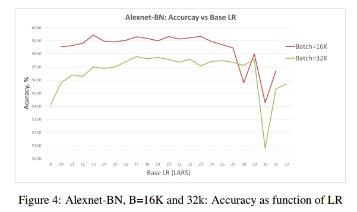
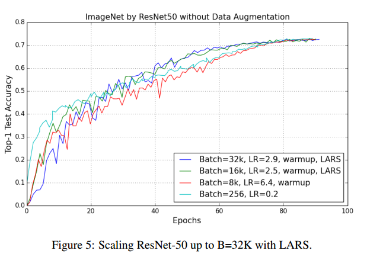

# LARGE BATCH TRAINING OF CONVOLUTIONAL NET NETWORKS

## Contact me

* Blog -> <https://cugtyt.github.io/blog/index>
* Email -> <cugtyt@qq.com>
* GitHub -> [Cugtyt@GitHub](https://github.com/Cugtyt)

> **本系列博客主页及相关见**[**此处**](https://cugtyt.github.io/blog/papers/index)

---

<head>
    
    
</head>

## ABSTRACT

通常加速训练卷积网络的方法是增加计算单元，使用数据并行的SGD，把批量数据分发到计算单元上，随着计算节点的增加，批量也增大。但是使用大批量会导致很低的模型准确率。我们认为当前对大批量训练的处理（线性学习率放大，以及warm-up）不能够很好的泛化，训练会发散。为了克服优化的困难，我们提出了基于层的自适应学习率方法Layer-wise Adaptive Rate Scaling (LARS)。通过这个方法，我们把Alexnet的批量放大到了8K，Resnet-50的批量放大到32K，同时没有准确率损失。

## 1 INTRODUCTION

通常使用更多的计算资源，增大批量来加快训练，但是增大批量通常会导致准确率降低。保持训练轮数，增大批量，意味着更新权重的次数变少。直接的方法是同比例放大学习率。但是使用大的学习率让优化更加困难，网络可能在初始阶段就发散了。为了解决这个困难，有人提出了学习率warm-up，从一个小的学习率开始，缓慢增加到我们需要的学习率。通过warm-up和线性放大，成功的将Resnet50用8K的批量训练。这也是当前最好的训练大批量策略。

我们尝试将这种方法在ImageNet上训练AlexNet，但是在2K批量的时候就开始发散了。对于4K的批量，准确率从57.6（256批量）到53.1，8K批量的时候准确率降到44.8%。为了使用大学习率，我们把局部响应标准化层 Local Response Normalization替换为Batch Normalization (BN)，记作AlexNet-BN。BN帮助了收敛，提高了准确率，对于8K的批量，准确率的差距从14%降低到了2.2%。

为了分析大学习率的训练稳定性，我们测量了层权重范数和梯度范数norm的比值。观察到，如果这个比值太大，训练就会不稳定，另外，如果比值太小，权重更新不够快。这个比值在不同的层情况不同，因此对不同的层使用不同的学习率是必要的。因此我们提出了Layer-wise Adaptive Rate Scaling (LARS)，LARS和自适应学习算法例如ADAM或RMSProp不同之处在于：首先，LARS对不同的层而不是不同的权重使用不同的学习率，其次，更新的量由权重的范数控制，用于更好的控制训练速度。使用LARS训练Alexnet-BN和Resnet50，批量可以达到32K也没有准确率损失。

## 2 BACKGROUND

通常使用随机梯度SG训练CNN，每一步t，采样一个批量B的样本`$x_i$`，计算损失函数梯度`$\nabla L(x_i, w)$`，更新网络权重：

$$w_{t+1}=w_{t}-\lambda \frac{1}{B} \sum_{i=1}^{B} \nabla L\left(x_{i}, w_{t}\right)$$

Krizhevsky建议使用如下方法训练大批量：批量B增大k倍，增大学习率k倍，其他超参数不动。例如$k=2$的时候，权重更新两轮为：

$$w_{t+2}=w_{t}-\lambda * \frac{1}{B}\left(\sum_{i=1}^{B} \nabla L\left(x_{i}, w_{t}\right)+\sum_{j=1}^{B} \nabla L\left(x_{j}, w_{t+1}\right)\right.$$

批量为2倍`$B_2=2*B$`的时候，学习率`$\lambda_2$`，权重更新为：

$$w_{t+1}=w_{t}-\lambda_2 * \frac{1}{2 * B}\sum_{i=1}^{2B} \nabla L\left(x_{i}, w_{t}\right)$$

假设$\nabla L\left(x_{j}, w_{t+1}\right) \approx L(x_j, w_t)$,带入$\lambda_2=2*\lambda$，二者就很相近了。

使用线性学习率放大，批量1K会有很小的准确率损失。批量2K就困难了，训练开始发散。使用BN会好很多。

另外有人结合了学习率warm-up，他们是当前最好的训练大批量的方法。

此外，有观察到大批量的泛化性会降低，得出的结论是大批量会收敛到尖锐的局部最优，但是没有解决方法。

## 3 ANALYSIS OF ALEXNET TRAINING WITH LARGE BATCH

使用BVLC实现的Alexnet，批量512作为基线。使用SGD，动量0.9，初始学习率0.01，2次多项式衰减100轮。基线准确率58%。然后，我们使用大学习率，批量4K，学习率调到0.08，但是学习率大于0.06后，即使是用warm-up也会发散。最后的准确率是批量4K下得到53.1%，学习率0.05。见表1（a）。

为了稳定训练，我们把Local Response Normalization换成了BN层，批量512的基线为60.2%，使用BN可以不用warm-up的情况下使用大的学习率，批量4K，最好的准确率是58.9%(学习率0.18)，批量8K准确率58%(学习率0.3)。

在批量8K的时候仍然有2.2%准确率的损失。我们观察了训练和测试曲线，没有发现显著的差异。我们的结论是准确率下降不是因为泛化差异，二十训练不足。

## 4 LAYER-WISE ADAPTIVE RATE SCALING (LARS)

标准的SGD对所有层使用同样的学习率，`$w_{t+1}=w_t-\lambda \nabla L(w_t)$`。学习率很大的时候，更新`$\Vert \lambda * \nabla L(w_t) \Vert$`可能比$\Vert w \Vert$大，这会导致发散。这让初始阶段的对初始权重和初始学习率高度敏感。我们发现权重和梯度的L2范数比值$\Vert w \Vert / \Vert \nabla L(w_t)\Vert$在权重和偏置上，以及层之间差异很大，如表2。比值在初始阶段很大，几轮之后减小。

对于某些层，如果学习率大于这个比值，训练就开始不稳定了。学习率warm-up可以来解决这个问题。

我们希望使用不同的方法，对每层$l$使用局部学习率$\lambda ^l$：

$$\Delta w_t^l = \gamma * \lambda ^l * \nabla L(w_t^l)$$

其中$\gamma$是全局学习率，局部学习率通过置信相关度$\eta <1$来定义：

$$\lambda ^l = \eta \times \frac{\Vert w^l \Vert}{\Vert \nabla L(w_t)\Vert}$$

注意，现在更新的量不在取决于梯度的大小，因此可以部分减少梯度消失和爆炸的问题。可以容易的进行扩展，平衡学习率和权重衰减项$\beta$：

$$\lambda ^l = \eta \times \frac{\Vert w^l \Vert}{\Vert \nabla L(w_t)\Vert + \beta * \Vert w^l \Vert}$$

## 5 TRAINING WITH LARS

使用批量32K，再次训练Alexnet和Alexnet-BN，如图3，【略】

## 7 CONCLUSION

提出了LARS，可以使用32K的批量训练Alexnet和Resnet50，高于32K批量如何不损失准确率仍然是个问题。