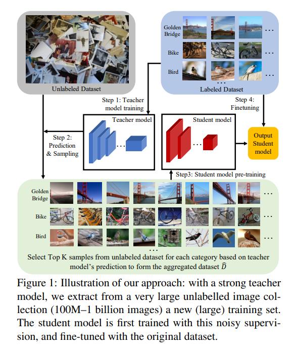

# Billion-scale semi-supervised learning for image classification <!-- omit in toc -->

## Contact me <!-- omit in toc -->

* Blog -> <https://cugtyt.github.io/blog/index>
* Email -> <cugtyt@qq.com>
* GitHub -> [Cugtyt@GitHub](https://github.com/Cugtyt)

> **本系列博客主页及相关见**[**此处**](https://cugtyt.github.io/blog/papers/index)

---

- [步骤：](#步骤)
- [海量数据半监督学习建议：](#海量数据半监督学习建议)
- [步骤详解](#步骤详解)
- [实验结果](#实验结果)

## 步骤：

1. 使用带标签的数据集得到一个初始的teacher模型；
2. 使用teacher模型对无标签数据进行预测，对每个类别标签的图像进行排序，挑选最好的K个构建新的训练数据；
3. 使用构建的数据训练一个student模型，通常这个模型和teacher不一样，（student小一些），这样可以减少测试时的复杂度；
4. 最后，训练的student模型在开始的有标签数据上微调，来减弱潜在的误标签情况。

## 海量数据半监督学习建议：

1. 用teacher/student模式训练：即使teacher和student是相同的结构，也能在给定复杂度的情况下生成更好的模型；
2. 只用有真实标签的数据微调模型；
3. 海量未标记数据是性能的关键；
4. 使用大量的预训练轮数，这里和普通的监督学习不同，在监督学习中，通常一定数量的轮数就足够了。
5. 对于预测的标签，构建一个平衡的分布；
6. 对预训练的（大容量）teacher模型，用弱监督的方法能进一步提升结果。

## 步骤详解

1. 训练teacher
   * 这里teacher可以并行处理；
   * 这里需要一个足够好的teacher模型，因为要负责标记无标签数据，尽量少引入噪声

2. 数据选择和标记
   * teacher模型对于每个样本预测，获得softmax的预测向量
   * 对于每个类，基于类别分数，选取最高的K个图像，组成新的数据集

3. 训练student模型，以及微调
   * 使用新的数据集训练一个student模型，模型结构可以和teacher一样，也可以更简单
   * 得到的student模型在原始的有标签数据集上微调，并在测试集上预测

## 实验结果

