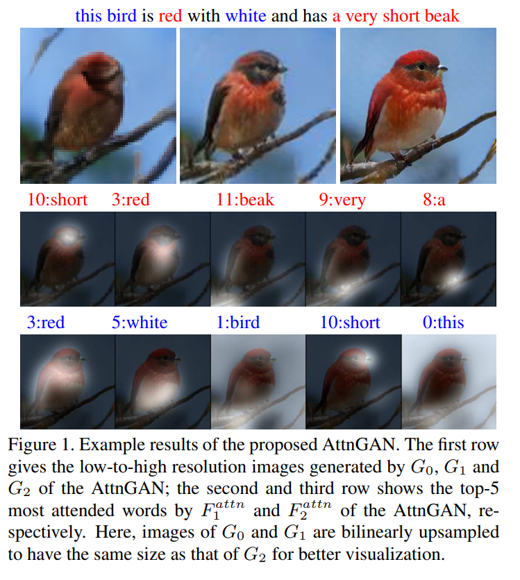
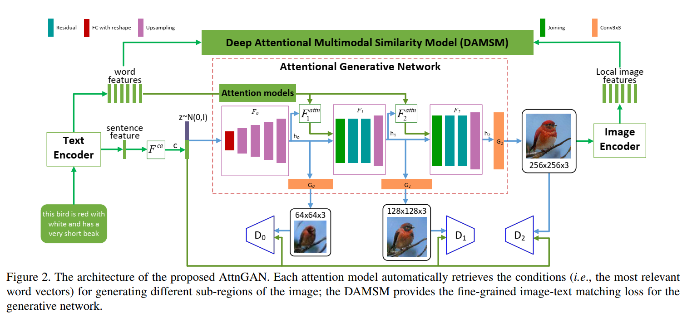
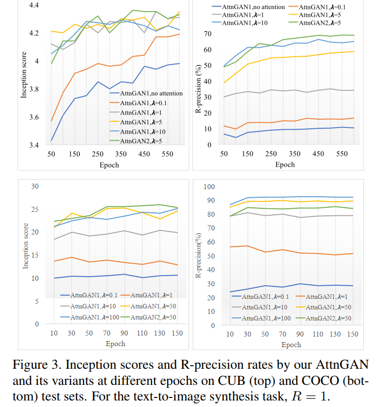
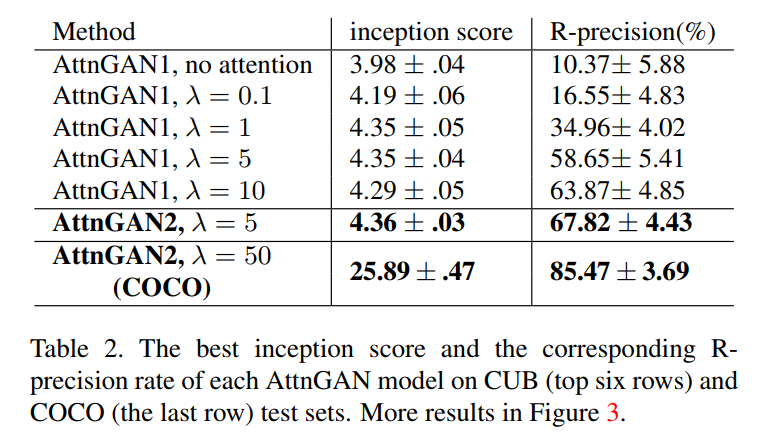
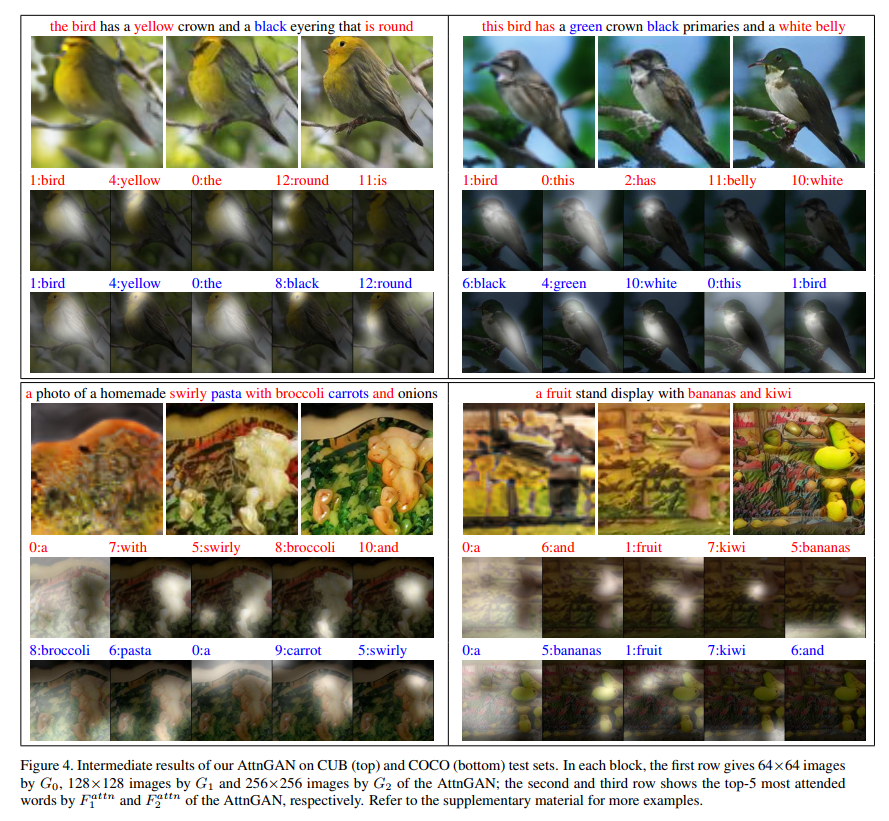
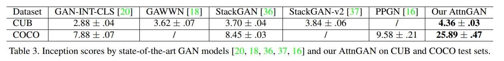

# AttnGAN: Fine-Grained Text to Image Generation with Attentional Generative Adversarial Networks <!-- omit in toc

## Contact me

* Blog -> <https://cugtyt.github.io/blog/index>
* Email -> <cugtyt@qq.com>
* GitHub -> [Cugtyt@GitHub](https://github.com/Cugtyt)

> **本系列博客主页及相关见**[**此处**](https://cugtyt.github.io/blog/papers/index)

<head>
    
    
</head>

---

## Abstract

本文提出了Attentional Generative Adversarial Network (AttnGAN)，可以做到注意力驱动，多阶段优化的高质量文本到图像的生成。通过对语言描述的相关词汇赋予注意力，AttnGAN可以合成不同子区域高质量的图像细节。

## 1. INTRODUCTION

一个常用的方法是把整个文本编码成一个全局语句向量作为条件生成图像。但是只依赖全局语句向量缺乏词级别的细粒度信息，不能生成高质量的图像。这个问题在生成复杂场景图像中尤其明显。

因此我们提出了Attentional Generative Adversarial Network (AttnGAN)，可以达到注意力驱动，多阶段细粒度优化的文本到图像的生成。整个结构见图2。这个模型包括两个创新部分。第一个是注意力的生成网络，使用注意力机制，关注和子区域最相关的词，来生成不同的子区域。具体来说，除了编码全局语义向量外，每一个词也编码为一个词向量。生成网络在第一阶段使用全局向量生成低分辨的图像。后续阶段，使用注意力层，通过每个子区域的图片向量来查询词向量构建一个词-上下文的向量。然后结合区域图片向量和对应的词-上下文向量来构建一个多模态上下文向量。基于这个向量，模型在子区域附近生成新的图片特征。每个阶段都可以生成更多的细节。第二个部分是Deep Attentional Multimodal Similarity Model (DAMSM)。借助注意力机制，DAMSM可以计算生成图像和全局语句信息，细粒度的词向量信息之间的相似度。因此，DAMSM提供了额外的细粒度的图像-文本匹配损失函数，用于训练生成器。

贡献是三个方面：1. 注意力的GAN用于根据文本过程图像，两个创新部分是注意力的生成网络和DAMSM。2. 大量的研究来衡量AttnGAN，可以超过其他的最好GAN模型。3. 用可视化注意力层仔细分析了模型，首次证明了层的条件GAN可以自动关注相关词，构建图片生成的条件。

## 3. Attentional Generative Adversarial Network

其他的文本到图像生成通常把整句话编码成单个向量用于图像生成的条件，但是缺乏细粒度词级别的信息。

如图2所示，模型包括$m$个生成器$(G_0,G_1,\dots,G_{m-1})$，把中间状态$(h_0,h_1,\dots,h_{m-1})$作为输入，生成从小到大尺寸$(\hat{x}_0, \hat{x}_1, \dots, \hat{x}_{m-1})$的图像。

$$h_0 = F_0(z, F^{ca}(\overline{e}))$$
$$h_i = F_i(h_{i - 1}, F^{attn}_i (e, h_{i-1})) for i=1,2,\dots,m-1;$$
$$\hat{x}_i = G_i(h_i).$$

$z$是正态分布采样的噪声向量。$\overline{e}$是整体语句向量，$e$是词汇向量矩阵，$F^{ca}$是条件增强，把语句向量$\overline{e}$转为条件向量。$F_i^{attn}$是我们提出的注意力模型，位于第$i$个阶段。大写字母的都用网络建模。

注意力模型$F^{attn}(e,h)$有两个输入：词特征$e \in \mathbb{R}^{D \times T}$和前一层的图像特征$h \in \mathbb{R}^{\hat{D} \times N}$。词向量词向量先通过添加一个新的感知层转为图像特征的通用语义空间，即$e'=Ue$，其中$U \in \mathbb{R}^{\hat{D}\times D}$。然后基于中间特征h为图像的每个子区域计算词-上下文向量。h的每一列是一个图像子区域的特征向量。对于第j各自区域，他的词-上下文是词向量关于$h_j$的动态表示，计算公司为：

$$c_j = \sum _{i=0}^{T - 1} \beta_{j,i}e'_i$$
$$\Beta_{j,i} = \frac{exp(s'_{j,i})}{\sum_{k=0}^{T-1} exp(s'_{j,k})}$$

$s'_{j,i} = h^T_j e'_i$,$\Beta_{j,i}$表示模型在生成图像第j个子区域注意第i个词的权重。把对于图像特征集$h$的词-上下文矩阵为$F^{attn}(e,h) = (c_0, c_1, \dots, c_{N-1}) \in \mathbb{R}^{\hat{D} \times N}$。最后图像特征和对应的词-上下文特征结合起来生成下一阶段的图像。为了在多个级别（语句级别和词级别）条件下生成真实的图像，最后的目标函数定义为：

$$\mathcal{L} = \mathcal{L}_G + \lambda \mathcal{L}_{DAMMSM}$$
$$\mathcal{L}_G = \sum_{i=0}^{m-1} \mathcal{L}_{G_i}$$

$\lambda$是超参数，用于平衡两项。第一项GAN损失同时近似条件和非条件分布。第i阶段的生成器有对应的判别器，对抗损失$G_i$定义为：

$$\mathcal{L}_{G_i} = \underbrace{-\frac{1}{2} \mathbb{E}_{\hat{x}_i \sim pG_i}[\log(D_i(\hat{x}_i))]}_{\text{unconditional loss
}} \underbrace{-\frac{1}{2} \mathbb{E}_{\hat{x}_i \sim pG_i}[\log(D_i(\hat{x}_i, \overline{e}))]}_{\text{conditional loss
}}$$

非条件损失决定图像真假，条件损失决定图像是否匹配语句。

判别器是：

$$\mathcal{L}_{D_i} = \underbrace{-\frac{1}{2} \mathbb{E}_{x_i \sim p_{{data}_i}}[\log D_i(x_i)] -\frac{1}{2} \mathbb{E}_{x_i \sim p_{G_i}}[\log (1 - D_i(\hat{x}_i))]}_{\text{unconditional loss}}\\ \underbrace{-\frac{1}{2} \mathbb{E}_{x_i \sim p_{{data}_i}}[\log D_i(x_i, \overline{e})] -\frac{1}{2} \mathbb{E}_{x_i \sim p_{G_i}}[\log (1 - D_i(\hat{x}_i, \overline{e}))]}_{\text{conditional loss}}$$

AttnGAN的判别器是不关联的，因此可以在每个图像尺度上平行训练。$\mathcal{L}_{DAMSM}$在下一节解释。

### 3.2. Deep Attentional Multimodal Similarity Model

DAMSM学习两个网络，把图片子区域和语句中的词映射到公共语义空间，因此可以计算细粒度的相似性。

**文本编码器** 是一个双向LSTM，从文本中提取语义向量。其中，每个文字对应于两个中间状态，每个方向一个。因此可以把两个状态拼接起来表示一个词的语义。所有词的特征矩阵记作$e \in \mathcal{R}^{D\times T}$。第i列是第i个词特征向量。D是词向量维度，T是词数。同时，最后一个隐层状态拼接起来表示全局语句向量，记作$\overline{e} \in \mathbb{R}^D$。

**图像编码器** 是一个卷积网络，图像映射到语义向量。中间层学习不同子区域的局部特征。这里使用预训练的InceptionV3模型。把输入图像放大到299，提取特征矩阵$f \in \mathbb{R}^{768 \times 289}$, 由模型中的 mixed_6e ($768\times 17\times 17$) reshape得到。全局特征$\overline{f} \in \mathbb{R}^{2048}$ 从最后一个平均池化层得到。通过一个感知层映射到公共语义空间：

$$v = W f, \overline{v} = \overline{W} \overline{f}$$

$v \in \mathbb{R}^{D \times 289}$，第i列是第i个子区域的视觉特征向量。$\overline{v} \in \mathbb{R}^D$是整个图像的全局向量。D是多模态特征空间长度。新添加的网络是需要学习的，其他是固定的。

**注意力驱动的图像-文本匹配分数** 用于衡量匹配程度，首先计算所有可能的文字-图像区域对的相似矩阵：

$$s = e^Tv$$

其中$s \in \mathbb{R}^{T \times 289}$，$s_{i,j}$是第i个词和第j个子区域的点积。可以如下归一化：

$$\overline{s}_{i,j} = \frac{\exp(s_{i, j})}{\sum_{k=0}^{T-1} \exp (s_{k, j})}$$

然后建立一个注意力模型来计算每个词的区域-上下文向量。区域-上下文向量$c_i$是图像子区域对应于第i个词的动态表示。计算为所有视觉区域向量的加权和：

$$c_i = \sum_{j=0}^{288} \alpha_j v_j$$
$$\alpha_j = \frac{\exp(\gamma_1 \overline{s}_{i,j})}{\sum_{k=0}^{288} \exp (\gamma_1 \overline{s}_{i,k})}$$

这里$\gamma_1$表示了在为一个词计算区域-上下文向量时对相关的子区域给多少注意力。

最后，用余弦相似定义第i个词和向量的相关性。$R(c_i, e_i) = (c_i^Te_i)/(\Vert c_i\Vert \Vert e_i \Vert)$。这个图像Q和整个文本D的**注意力驱动的图像-文本匹配分数**定义为：

$$R(Q,D) = \log (\sum_{i=1}^{T-1} \exp(\gamma_2 R(c_i, e_i)))^{\frac{1}{\gamma_2}} \quad (10)$$

$\gamma_2$时最相关的词到区域的上下文对的重要性。当$\gamma_2 \to \infin$，$R(Q,D)$近似到$\max _{i=1}^{T-1} R(c_i, e_i)$。

**DAMSM损失**用于学习半监督情况下的注意力模型，监督的部分时整个图像和整个语句的匹配。对于一个批量的图像-语句对$\{(Q_i, D_i) \}_{i=1}^M$，匹配图像的$Q_i$语句$D_i$的后验概率计算为：

$$P(D_i \vert Q_i) = \frac{\exp (\gamma_3 R(Q_i, D_i))}{\sum_{j=1}^M \exp (\gamma_3 R(\gamma_3 R(Q_i, D_j)))} \quad (11)$$

其中$\gamma_3$时平滑因子，由实验决定。在一个批量语句中，只有一个$D_i$匹配图像$Q_i$，其他的$M-1$个语句视为不匹配。损失函数为后验负对数概率：

$$\mathcal{L}_1^w = -\sum_{i=1}^M \log P(D_i \vert Q_i) \quad (12)$$

$w$表示词。

同时我们也最小化：

$$\mathclap{L}_2^w = -\sum_{i=1}^M \log P(Q_i \vert D_i) \quad (13)$$

这里$P(Q_i \vert D_i) = \frac{\exp (\gamma_3 R(Q_i, D_i))}{\sum_{j=1}^M \exp(\gamma_3 R(Q_j, D_i))}$时语句$D_i$匹配图像$Q_i$的后验概率。如果重定义公式10为$R(Q,D)=(\overline{v}^T\overline{e})/(\Vert \overline{v} \Vert \Vert \overline{e} \Vert)$，代入公式11，12和13，可以得到损失函数$\mathcal{L}_1^s$和$\mathcal{L}_2^s$，(s表示语句)，最后的DAMSM损失定义为：

$$\mathcal{L}_{DAMSM} = \mathcal{L}_1^w + \mathcal{L}_2^w+ \mathcal{L}_1^s + \mathcal{L}_2^s$$

DAMSM是预训练得到的，使用真实的图像-文本对最小化得到。由于预训练DAMSM不限制生成图像的尺寸，这里使用299。另外，从图像文本对学到的文本编码器提供了具有视觉判别性的词向量特征。而在普通文本上预训练的向量不具有视觉判别性。

因此，我们提出了两个创新的注意力模型，注意力GAN和DAMSM，有不同的功能。1. GAN中的注意力机制可以自动挑选词级别的条件生成不同的子区域。2. DAMSM可以可以计算细粒度的文本-图像匹配损失。注意$L_{DAMSM}$只用在最后一个生成器上。如果用在所有的尺度上，计算量增大但是性能没有提升。

## 4. Experiments

## 5. Conclusions

AttnGAN用于生成细粒度的文本-图像合成。注意力GAN用于多阶段生成高质量的图像。注意力多模态相似模型用于计算细粒度图像-文本损失，可以训练生成器。AttnGAN极大的超过了现有的模型，IS分数在CUB上提高14.14%，在COCO上提高170.25%。