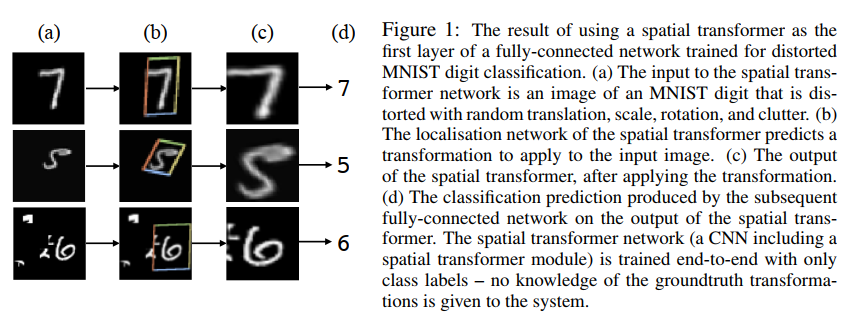
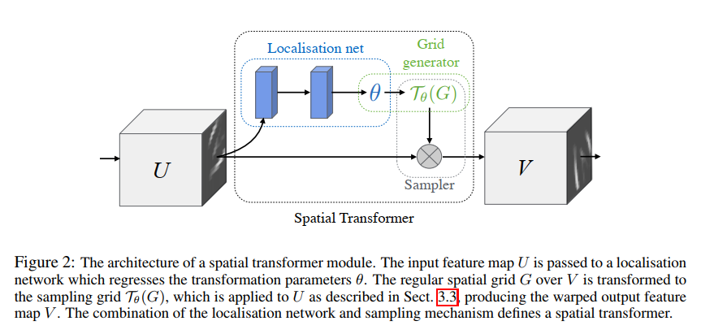
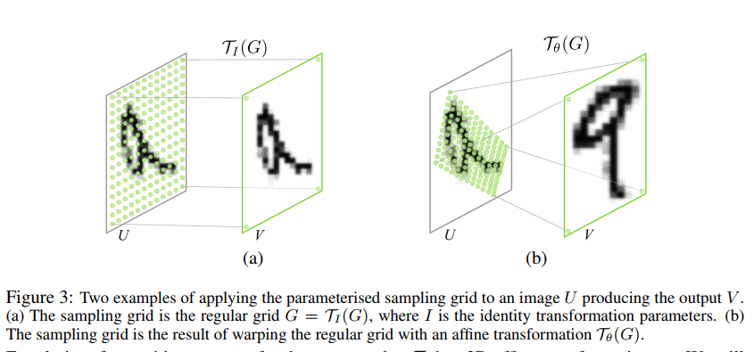
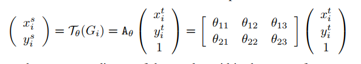
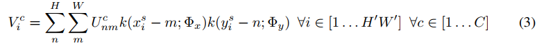
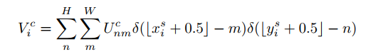
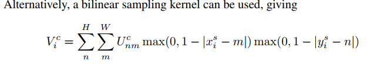
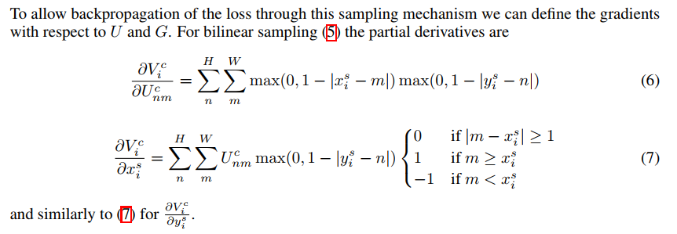

# Spatial Transformer Networks

## Contact me

* Blog -> <https://cugtyt.github.io/blog/index>
* Email -> <cugtyt@qq.com>
* GitHub -> [Cugtyt@GitHub](https://github.com/Cugtyt)

> **本系列博客主页及相关见**[**此处**](https://cugtyt.github.io/blog/papers/index)

<head>
    
    
</head>

---

## Abstract

The ability of spatially invariant of CNN is limited. This paper introduces a Spatial Transformer module, which manipulate the data in spatial way, and can be insserted to any CNN network, without andy extra training. It achieved state-of-the-art performance.

## 1 Introduction

Spatial transformer can be helpful for mutifariout tasks:

* classification. It crops out and scale-normalizes the appropriate region, which simplify the subsequent task.
* co-localisation.
* spatial attention.

## 3 Spatial Transformers

Spatial transformers mechanism is split into three parts:

* localisation network. It takes the input feature map, and outputs the parameters that should be applied to the feature map.
* grid generator. The output parameters of localisation network are used to create a sampling grid, which is a set of points where the input map should be used in the next stage.
* sampler, produce the output

### 3.1 Localisation Network

* input: $U \in \mathbb{R}^{H \times W \times C}$
* output: $\theta$

$\theta$ is varied on different transformation type, affine transformation $\theta$ is 6-dim. $\theta = f_{loc}(U)$

### 3.2 Parameterised Sampling Grid

only 6 params are reuqired to define $A_\theta$

### Differentiable Image Sampling

Integer sampling kernel reduces to:

