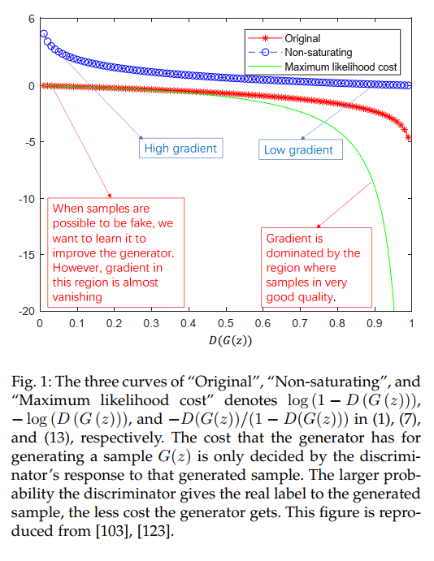
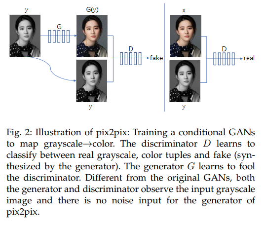

# A Review on Generative Adversarial Networks: Algorithms, Theory, and Applications

## Contact me

* Blog -> <https://cugtyt.github.io/blog/index>
* Email -> <cugtyt@qq.com>
* GitHub -> [Cugtyt@GitHub](https://github.com/Cugtyt)

> **本系列博客主页及相关见**[**此处**](https://cugtyt.github.io/blog/papers/index)

<head>
    
    
</head>

---

## 3 算法

### 3.1 GAN

#### 3.1.1 Objective function

$$\min_G \max_G V(D, G) = E_{x \sim p_{data}} [\log D(x)] + E_{z \sim p_z} [\log(1 - D(G(z)))]$$

固定G，最优的D为

$$D^*_G(x) = \frac{p_{data}}{p_{data} + p_g}$$

最小最大博弈就可以写成：

$$\max_D V(D, G) = \\
E_{x \sim p_{data}} [\log \frac{p_{data}}{p_{data} + p_g}] + E_{x \sim g} \frac{p_{data}}{p_{data} + p_g} - 2 \log 2\\
= 2 JS(p_{data} \Vert p_g) - 2 \log 2$$

在训练早期，G很差，D很容易判别，因此$\log (1 - D(G(z)))$就饱和了，这时候可以最大化$\log D(G(z))$。这样提供了更大的梯度。

下图展示了三种GAN目标的图像：

### 3.2 GANs’ representative variants

#### 3.2.1 InfoGAN

不光是用噪声作为输入，还加入了信息编码

$$\min_G \max_D V_I (D, G) = V(D, G) - \lambda I(c; G(z, c))$$

但是第二项需要获取到后验概率$P(c\vert x)$因此不好直接优化，因此使用一个近似分布$Q(c\vert x)$表示$P(c\vert x)$的下界。

#### 3.2.2 cGAN

给定额外信息的情况下可以构建条件GAN：

$$\min_G \max_D V(D, G) = E_{x \sim p_{data}} [\log D(x \vert y)] + E_{z\sim p_{z}} [\log (1 - D(G(z \vert y)))]$$

和infoGAN相似，但是infoGAN的隐码是不知道的需要学习。infoGAN需要额外的网络学习$Q(c\vert x)$

#### 3.2.3 CycleGAN

如果不存在合适的样本对的话没法直接训练判别器，CycleGAN可以通过反向再次生成解决这个问题。

#### 3.2.4 f-GAN

