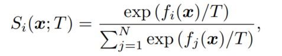
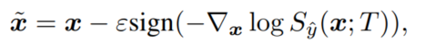
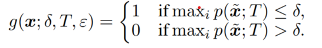
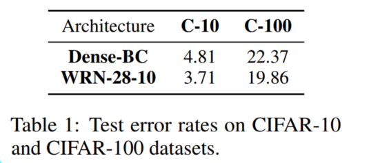
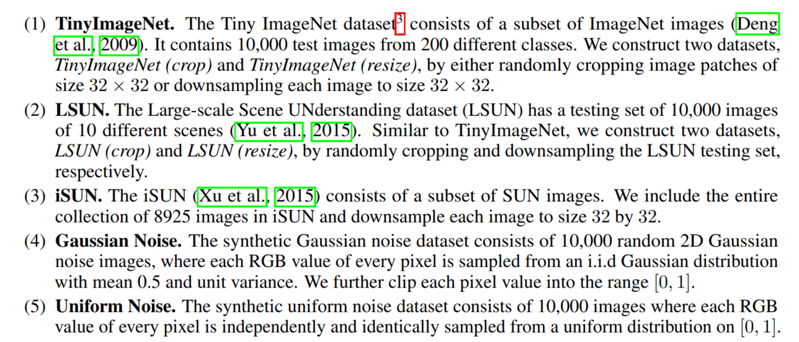
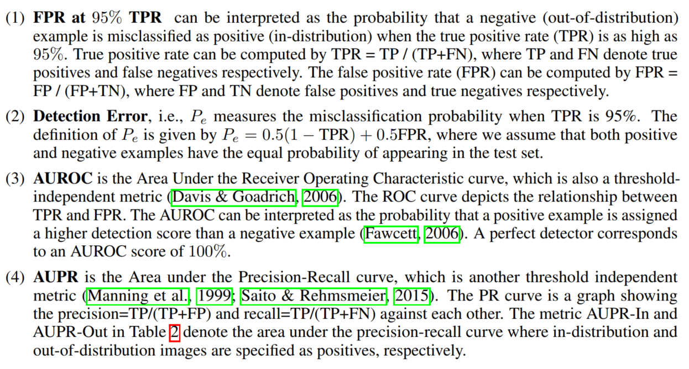
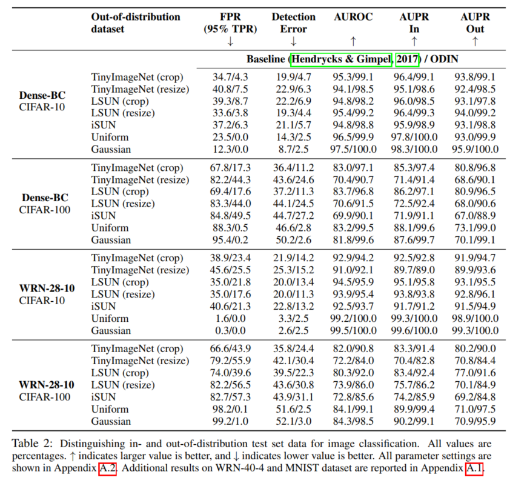

# ENHANCING THE RELIABILITY OF OUT-OF-DISTRIBUTION IMAGE DETECTION IN NEURAL NETWORKS

## Contact me

* Blog -> <https://cugtyt.github.io/blog/index>
* Email -> <cugtyt@qq.com>
* GitHub -> [Cugtyt@GitHub](https://github.com/Cugtyt)

> **本系列博客主页及相关见**[**此处**](https://cugtyt.github.io/blog/papers/index)

<head>
    
    
</head>

---

## ABSTRACT

文章考虑的问题是用神经网络检测分布外 out-of-distribution的图像。提出了ODIN，不需要修改预训练的网络，方法基于的观察是使用温度缩放和对输入添加扰动可以让分布内和分布外图像的softmax分数分布区分开来，让检测更高效。在多个网络结构和数据集上的实验证明了该方法可以稳定的优于基线方法。

## 1. INTRODUCTION

研究发现神经网络对于完全不可识别和不相干的输入会有很高置信度的预测，因此检测分布外的样本对于视觉识别任务而言具有重要意义。

一个看起来直接的检测分布外数据的方法是扩大分布内和分布外的数据样本，但是分布外的数据样本基本无限，再训练过程计算昂贵无法实现，另外，同时检测外分布和对内分布进行分类，需要相当大的网络结构。

Hendrycks & Gimpel提出了无再训练网络检测分布外数据的基线方法，方法基于的观察是，训练好的网络对于分布内的数据比分布外数据有更高的softmax分数。我们观察到，在对softmax使用温度缩放，对输入添加可控的扰动后，softmax分数对于分布内和分布外的间隔会拉大，结合这两个方法可以有更好的检测性能。贡献为：

* 提出了简单高效的方法ODIN，用于检测分布外的样本。该方法不需要再训练网络而且易于实现。
* 在多个网络上进行了实验，ODIN可以极大的提高性能，由于对比方法。
* 实验分析了参数对性能的影响，提供了简单的分析和直觉解释

## 2. PROBLEM STATEMENT

我们考虑预训练网络区分分布内和分布外图像的问题，令$P_X$和$Q_X$表示图像空间$X$两个不同分布的数据，神经网络$f$在$P_X$上进行训练，因此$P_X$和$Q_X$分别为内分布和外分布，测试时，在两个数据集混合后取出，并标记为0，1，这个问题是，给定一个来自混合分布的图像，我们能区分它来自哪个分布吗？

## 3. ODIN: OUT-OF-DISTRIBUTION DETECTOR

方法包括两部分：温度缩放和输入预处理。

**温度缩放**，假设网络$f$区分$N$类，对于每个$x$，网络用softmax进行预测 $\hat{y}(x)=\argmax_i S_i(x;T)$ :

$T$是温度缩放参数，训练时为1，对于给定的输入，softmax最大的概率值为softmax分数。后续会看到，好的温度控制可以让分布外的数据区分更明显。

**输入预处理**，在输入到网络之前，对输入添加扰动：

$\epsilon$可以用于控制扰动量。这里扰动的作用是对于任何输入增大softmax分数。后续会看到，扰动对于分布内的输入有更大的影响。

**分布外的检测器** 对于给定的图像x，先预处理得到$\tilde{x}$,然后喂入神经网络，计算softmax分数，并和阈值$\delta$比较，低于阈值为分布外样本，高于阈值为分布内样本：

## 4. EXPERIMENTS

【略】

## 7 CONCLUSIONS

ODIN，简单有效的检测分布外数据的方法，不需要再训练网络，极优于对比方法，实验分析了多种参数设置。