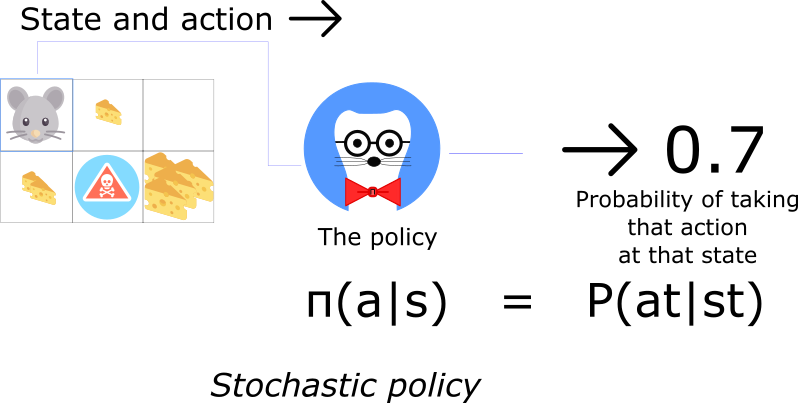
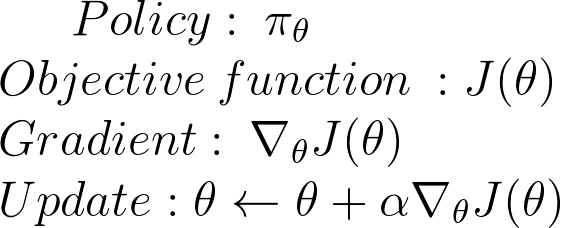

# An introduction to Policy Gradients with Cartpole and Doom

## Contact me

* Blog -> <https://cugtyt.github.io/blog/index>
* Email -> <cugtyt@qq.com>
* GitHub -> [Cugtyt@GitHub](https://github.com/Cugtyt)

---

> **本系列博客主页及相关见**[**此处**](https://cugtyt.github.io/blog/rl-notes/index)  
>
> 来自Thomas Simonini *Deep Reinforcement Learning Course* [Part 4: An introduction to Policy Gradients with Cartpole and Doom](https://medium.freecodecamp.org/an-introduction-to-policy-gradients-with-cartpole-and-doom-495b5ef2207f)

---

As a consequence, in value-based learning, a policy exists only because of these action-value estimates.

In policy-based methods, instead of learning a value function that tells us what is the expected sum of rewards given a state and an action, we learn directly the policy function that maps state to action (select actions without using a value function).

## Why using Policy-Based methods?

### Two types of policy

A policy can be either deterministic or stochastic.

A deterministic policy is policy that maps state to actions. You give it a state and the function returns an action to take.


a stochastic policy outputs a probability distribution over actions.



Most of the time we’ll use this **second** type of policy.

### Advantages

* Convergence

The problem with value-based methods is that they can have a big oscillation while training. This is because the choice of action may change dramatically for an arbitrarily small change in the estimated action values.

with policy gradient, we just follow the gradient to find the best parameters. We see a smooth update of our policy at each step.


* Policy gradients are more effective in high dimensional action spaces

The problem with Deep Q-learning is that their predictions assign a score (maximum expected future reward) for each possible action, at each time step, given the current state.

But what if we have an infinite possibility of actions?

* Policy gradients can learn stochastic policies

This has two consequences.

One of these is that we don’t need to implement an exploration/exploitation trade off. it outputs a probability distribution over actions. As a consequence, it handles the exploration/exploitation trade off without hard coding it.

We also get rid of the problem of perceptual aliasing. Perceptual aliasing is when we have two states that seem to be (or actually are) the same, but need different actions.


### Disadvantages

A lot of the time, they converge on a local maximum rather than on the global optimum.

However, we’ll see there are **solutions** to this problem.

## Policy Search


There are two steps:

* Measure the quality of a π (policy) with a policy score function J(θ)
* Use policy gradient ascent to find the best parameter θ that improves our π.

### First Step: the Policy Score function J(θ)

Three methods work equally well for optimizing policies. The choice depends only on the environment and the objectives you have.

First, in an episodic environment, we can use the start value. Calculate the mean of the return from the first time step (G1). This is the cumulative discounted reward for the entire episode.


In a continuous environment, we can use the average value, because we can’t rely on a specific start state.


Each state value is now weighted (because some happen more than others) by the probability of the occurrence of the respected state.

Third, we can use the average reward per time step. The idea here is that we want to get the most reward per time step.


### Second step: Policy gradient ascent




how do we find the effect of policy on the state distribution? The function of the environment is unknown.

As a consequence, we face a problem: how do we estimate the ∇ (gradient) with respect to policy θ, when the gradient depends on the unknown effect of policy changes on the state distribution?


R(tau) is like a scalar value score:

* If R(tau) is high, it means that on average we took actions that lead to high rewards. We want to push the probabilities of the actions seen (increase the probability of taking these actions).
* On the other hand, if R(tau) is low, we want to push down the probabilities of the actions seen.

## Monte Carlo Policy Gradients

We use Monte Carlo because our tasks can be divided into episodes.

``` raw
Initialize θ
for each episode τ = S0, A0, R1, S1, …, ST:
    for t <-- 1 to T-1:
        Δθ = α ∇theta(log π(St, At, θ)) Gt
        θ = θ + Δθ

For each episode:
    At each time step within that episode:
         Compute the log probabilities produced by our policy function. Multiply it by the score function.
         Update the weights
```

Because we only calculate R at the end of the episode, we average all actions. Even if some of the actions taken were very bad, if our score is quite high, we will average all the actions as good.

So to have a correct policy, we need a lot of samples… which results in slow learning.

## How to improve our Model?

* Actor Critic: a hybrid between value-based algorithms and policy-based algorithms.
* Proximal Policy Gradients: ensures that the deviation from the previous policy stays relatively small.

[play Cartpole代码](https://gist.github.com/simoninithomas/7a3357966eaebd58dddb6166c9135930#file-cartpole-reinforce-monte-carlo-policy-gradients-ipynb)

[play Doom代码](https://gist.github.com/simoninithomas/be159fc279cb1e927eec50e85f7483a0#file-doom-reinforce-monte-carlo-policy-gradients-ipynb)